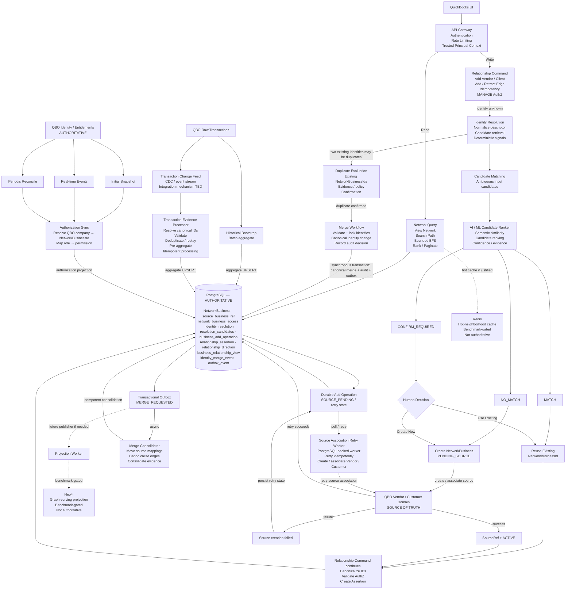

# QuickBooks Business Network — System Design

**Craft System Design — Senior Staff Builder**  
Status: **Provisional V1 design; implementation baseline frozen.** Open assumptions A2, A6, and A12 do not block implementation. A6 and A12 are isolated behind stable interfaces; A2 is different — if QuickBooks already provides a canonical cross-role business identity, the identity subsystem simplifies materially rather than merely reconfiguring. It is still safe to proceed provisionally because the graph, relationship, traversal, authorization, and API boundaries operate on `NetworkBusinessId` regardless of who ultimately owns that identity.

------------------------------------------------------------------------

## 1. Problem Statement

Design a system within QuickBooks that maps a business’s network of
vendor/client relationships, so a business can:

1.  **View its network** — a map of vendors and clients.
2.  **Search a specific relationship** — direct and indirect connections
    between two businesses.
3.  **Grow the network** — add a new vendor/client, which may or may not
    already exist under a different descriptor.
4.  **Stay highly available and responsive.**

Given constraints: ~1M businesses, ≤100 direct relationships/business,
10M relationship searches/month, undirected relationships weighted by
transaction volume, non-uniform (skewed) traffic.

------------------------------------------------------------------------

## 2. Clarifying Questions Sent to Intuit

1.  Is a business network view bounded to a fixed number of hops, or
    must it support arbitrary-depth exploration?
2.  For “search a specific relationship,” is a boolean connectivity
    answer sufficient, or is a path/route between the two businesses
    required?
3.  When a new business is added and might already exist under a
    different descriptor, is automatic high-confidence matching
    acceptable, or must ambiguous matches always require human
    confirmation?
4.  Must a newly created relationship be visible in every subsequent
    read immediately (strong consistency), or is brief propagation delay
    acceptable?
5.  Is graph traversal expected to enforce per-business authorization
    (i.e., can a business see relationships it isn’t a party to)?
6.  *(Not yet sent — pending)* Does QuickBooks already expose a
    canonical business identity shared across Vendor and Customer
    records, or must the Business Network resolve multiple
    Vendor/Customer descriptors into its own network-level business
    identity?

Until answered, the design below proceeds on documented provisional
assumptions (Section 3), each isolated so a wrong guess is a
configuration or schema change, not a rewrite.

------------------------------------------------------------------------

## 3. Assumption Register

| ID  | Question                                                                                         | Working assumption                                                                                                                                                                                                                                                                                                                                                                                                  | Basis                                                                                              | Confidence                                                     | Pivot cost                                                                              |
|:----|:-------------------------------------------------------------------------------------------------|:--------------------------------------------------------------------------------------------------------------------------------------------------------------------------------------------------------------------------------------------------------------------------------------------------------------------------------------------------------------------------------------------------------------------|:---------------------------------------------------------------------------------------------------|:---------------------------------------------------------------|:----------------------------------------------------------------------------------------|
| A1  | What does QBO’s source identity model look like?                                                 | Role-oriented records (Vendor, Customer) — no single canonical cross-role Business ID                                                                                                                                                                                                                                                                                                                               | Public QBO domain model                                                                            | High (as a fact about QBO)                                     | —                                                                                       |
| A2  | Does the Business Network need its own identity layer?                                           | Yes — introduces `NetworkBusinessId` unifying Vendor/Customer references                                                                                                                                                                                                                                                                                                                                            | Our architectural choice, weakly supported by “already exist in the network” wording in use case 3 | Medium (design confidence: High — this is what we’re building) | Very High                                                                               |
| A3  | Can multiple typed source records map to one NetworkBusiness?                                    | Yes                                                                                                                                                                                                                                                                                                                                                                                                                 | Follows from A1/A2                                                                                 | Medium                                                         | High                                                                                    |
| A4  | Max network-view traversal depth                                                                 | Bounded, initial default 3 hops, server-capped and rejects out-of-range requests                                                                                                                                                                                                                                                                                                                                    | Our assumption                                                                                     | Low                                                            | Medium                                                                                  |
| A5  | Relationship search semantics                                                                    | Return path (not just boolean), shortest by **hop count**, not by weight                                                                                                                                                                                                                                                                                                                                            | Our assumption; weight-as-cost is semantically undefined by the prompt                             | Low                                                            | Medium                                                                                  |
| A6  | Relationship freshness                                                                           | Undecided — PostgreSQL-only V1 supports strong/read-your-writes; eventual projection remains an evolution option                                                                                                                                                                                                                                                                                                    | Asked Intuit (Q4)                                                                                  | Low                                                            | Medium for PostgreSQL-only V1; High only if a separate serving projection is introduced |
| A7  | Is authorization required during traversal?                                                      | Yes                                                                                                                                                                                                                                                                                                                                                                                                                 | Security requirement we impose for sensitive financial relationship data                           | **High**                                                       | High                                                                                    |
| A8  | Authorization model / edge-visibility rule                                                       | Provisional: both endpoints must be visible to the principal for an edge to be traversable (conservative default)                                                                                                                                                                                                                                                                                                   | Not specified by Intuit; our conservative V1 choice                                                | Low                                                            | High                                                                                    |
| A9  | Ambiguous identity handling                                                                      | Uncertain matches always require user confirmation; never auto-merge in V1                                                                                                                                                                                                                                                                                                                                          | Deliberate V1 safety policy                                                                        | **High** (deliberate choice, not uncertainty)                  | Medium                                                                                  |
| A10 | Resolution transport | **Synchronous in V1** — `POST /businesses/resolve` returns `MATCH / NO_MATCH / CONFIRM_REQUIRED` directly. Async candidate-generation is an evolution only if benchmarking shows the interactive latency budget cannot be met | Deliberate V1 simplification; logical resolution contract remains transport-independent | Medium | Low |
| A11 | Relationship weight formula                                                                      | Undecided — preserve raw aggregates (`transactionCount`, `transactionAmount`, `lastTransactionAt`); do not invent a derived formula at architecture time                                                                                                                                                                                                                                                            | Prompt says “weighted by transaction volume” but doesn’t define it                                 | Low                                                            | Low                                                                                     |
| A12 | Relationship source (who/what creates an assertion)                                              | **Undecided — largest remaining write-path gap.** Modeled to support USER, TRANSACTION, and IMPORT provenance simultaneously                                                                                                                                                                                                                                                                                        | Not established by prompt                                                                          | Low                                                            | Medium                                                                                  |
| A13 | Network-view query budget (nodes/edges/timeout)                                                  | Undecided — must be derived from UX (how many nodes can a human meaningfully view), not invented                                                                                                                                                                                                                                                                                                                    | Product/UX-dependent                                                                               | Low                                                            | Low                                                                                     |
| A14 | Path-search query budget                                                                         | Independent of A13 — different UX, different tolerance                                                                                                                                                                                                                                                                                                                                                              | Different access pattern                                                                           | Medium                                                         | Low                                                                                     |
| A15 | Who’s authoritative for source-record data                                                       | QBO remains authoritative for Vendor/Customer records and their attributes                                                                                                                                                                                                                                                                                                                                          | Design boundary we impose                                                                          | High                                                           | High                                                                                    |
| A16 | Who owns identity unification / mapping                                                          | Business Network owns `NetworkBusiness`, source mappings, and merge decisions                                                                                                                                                                                                                                                                                                                                       | Follows from A2/A3                                                                                 | Medium                                                         | Very High                                                                               |
| A17 | Edge-visibility policy for traversal                                                             | Conservative default: an edge A↔B is only traversable if the principal can see **both** A and B                                                                                                                                                                                                                                                                                                                     | No Intuit guidance; chosen to fail toward under-disclosure, not over-disclosure                    | Low (policy is provisional; the *need* for a rule is not)      | Medium                                                                                  |
| A18 | Does the P95 benchmark include authorization cost?                                               | Yes — authorization predicate evaluation is counted as part of “work performed” in every benchmark run                                                                                                                                                                                                                                                                                                              | Otherwise the spike measures an unrepresentative query                                             | High                                                           | —                                                                                       |
| A19 | Does path search distinguish “no path exists” from “path exists but runs through a hidden node”? | No — both return the same not-found response. This is a **deliberate parallel** to the depth-bound trade-off we otherwise reject: for depth, `NOT_FOUND_WITHIN_DEPTH` vs `NOT_CONNECTED` are kept distinct because there’s no privacy reason to hide the difference; for hidden intermediaries, collapsing them is intentional, because confirming “a path exists via someone you can’t see” is itself a disclosure | Privacy requirement (A7/A17) outweighs precision here, unlike the depth case                       | Medium                                                         | Low                                                                                     |

**Frozen V1 identity/relationship/authorization/operations invariants:**

    IDENTITY
     1. NetworkBusiness is our provisional network-level canonical identity.
     2. QBO Vendor/Customer references map to it (typed SourceRecordKey).
     3. Ambiguous identity matches require confirmation — never silent auto-merge.
     4. Identity merges are non-destructive (mark SUPERSEDED, never delete).
     5. Merge history (identity_merge_event) is append-only.
     6. Merge decisions and provenance are retained for audit and controlled remediation.
     7. Overlapping merges are serialized (pessimistic lock + canonical
        root re-resolution at confirmation time).
     8. Canonical-root state is normalized at merge time; audit trail is not.
     9. Supersession cycles are prohibited (root-match rejection, not just
        a direct self-reference CHECK).

    RELATIONSHIPS
    10. Network relationship is undirected because the Craft requirement says so.
    11. Directional transaction provenance is retained regardless.
    12. Directional transaction metrics (relationship_direction) are authoritative.
    13. Undirected metrics (`business_relationship_view`) are derived, never written directly.
    14. Multiple assertions (USER, TRANSACTION, IMPORT) may establish one logical
        relationship simultaneously.
    15. Assertions are retracted (status = RETRACTED), not deleted.
    16. The derived serving projection is gated on at least one ACTIVE assertion —
        retraction is not cosmetic.
    17. Merge consolidation canonicalizes affected assertion endpoints and collapses duplicate logical edges created by the merge without deleting provenance.
    18. Pending-consolidation reads canonicalize and aggregate duplicate
        logical edges on the fly (more expensive than post-consolidation reads
        — the reason consolidation exists at all).
    19. Every ordinary write to relationship_direction/relationship_assertion
        resolves business IDs to current canonical form first — this guards
        against a third-party write racing an in-flight merge, which neither
        the merge lock nor the consolidation job's version check alone covers.

    AUTHORIZATION
    20. Authorization participates during traversal expansion, not as a
        post-hoc filter on a fully resolved response.
    21. Both endpoints must be visible for an edge to be traversable (A17).
    22. Hidden nodes cannot be used as invisible traversal intermediaries —
        and this deliberately reintroduces, for privacy reasons, the same
        "can't distinguish absence from exclusion" imprecision that depth-
        bounding otherwise avoids (A19). Confirming a path exists via a
        business the requester can't see is itself a disclosure.

    OPERATIONS
    23. Merge consolidation is idempotent via an explicit completion check
        against identity_merge_event, not incidental arithmetic safety.
    24. Async consolidation jobs revalidate canonical versions and retry on
        STALE_MERGE_STATE rather than blindly applying.
    25. Resolution decisions plus bounded top-K candidates are retained.
    26. Full-network periodic identity reconciliation (resolution drift) is
        explicitly deferred from V1, reusing the same merge/confirm
        infrastructure when built.
    27. Incorrect merges are handled through a controlled administrative
        reconciliation workflow. Generic automatic merge reversal is outside V1.


**Still genuinely open (not resolved by the above, logged rather than
silently absent):**

- **A12 — relationship source /** **`source_reference`** **semantics**:
  what identifies the originating record differs by `source_type` and
  isn’t yet defined; blocks finalizing the relationship-mutation API.
- **`network_business.status = PENDING_SOURCE`**: resolved provisionally
  for V1. `POST /businesses/resolve` remains read-only. Only the
  side-effecting Add Vendor/Client command may create a new
  `NetworkBusiness` after a `NO_MATCH` result or an explicit **Create
  New** decision. It creates the identity in `PENDING_SOURCE`,
  idempotently creates/associates the QBO Vendor/Customer source record,
  attaches the resulting typed source reference, then transitions to
  `ACTIVE`. Relationship creation is allowed only after `ACTIVE`.
  Temporary source failures are retried by a server-owned reconciliation
  worker; exhausted or abandoned operations transition to
  `SOURCE_CREATION_FAILED` rather than leaving an orphan pending
  forever.
- **Resolution drift**: covered by invariant 26 as a deferral, not a
  fix.

------------------------------------------------------------------------

## 4. Functional Requirements

**FR1 — View business network** `GET /businesses/{id}/network?depth=N` —
direct + bounded multi-hop relationships, server-capped depth (reject,
don’t silently clamp, out-of-range requests), authorization-filtered,
ranked and paginated for UI consumption. Traversal is additionally bounded by
`maxExploredNodes`, `maxExploredEdges`, and timeout; response size is bounded
separately by `maxReturnedNodes`, `maxReturnedEdges`, and page size.

**FR2 — Search relationship** `GET /relationships/path?from=A&to=B` —
shortest path by **hop count**. Weight represents relationship
*strength*, not traversal *cost*; using transaction amount as edge cost
is semantically undefined (a ₹10M edge could mean “closer” or “further”
with no basis to choose). If no path is found within the search’s depth
budget, the response is `NOT_FOUND_WITHIN_DEPTH` (searched-but-bounded),
never `NOT_CONNECTED` (a stronger claim than what was proven).

**FR3 — Add vendor/client relationship** Add a business as a
vendor/client, resolving identity before creating the relationship (see
FR4).

**FR4 — Business identity resolution** Given a Vendor/Customer
descriptor, determine whether it represents an existing
`NetworkBusiness` or requires creating a new one. Ambiguous matches
require user confirmation (A9); resolution-service unavailability fails
**closed** (no speculative business creation), not open.

### FR4a — New-business creation sequence (provisional V1)

`POST /businesses/resolve` is **read-only**: it returns `MATCH`,
`NO_MATCH`, or `CONFIRM_REQUIRED` and never creates a `NetworkBusiness`.
The side-effecting sequence below belongs to
`POST /businesses/{ownerBusinessId}/vendors` after that command obtains
a `NO_MATCH` resolution result (or after the user explicitly chooses
**Create New**).

``` text
POST /businesses/{ownerBusinessId}/vendors  [Idempotency-Key]
      │
      ├─ resolve descriptor (read-only)
      │
      ├─ MATCH / confirmed existing ───────────────► use ACTIVE NetworkBusiness
      │
      └─ NO_MATCH / user chose Create New
                    │
                    ▼
          Create NetworkBusiness(status=PENDING_SOURCE)
                    │
                    ▼
          Idempotently create/associate QBO Vendor/Customer source record
                    │
                 ┌──┴──┐
               success failure/timeout
                 │       │
                 ▼       ▼
          Attach typed   Remain PENDING_SOURCE;
          source ref     server-owned background retry
                         │
                         └─ retries exhausted/abandoned
                            → SOURCE_CREATION_FAILED
                 │
                 ▼
          NetworkBusiness(status=ACTIVE)
                 │
                 ▼
          Create relationship assertion
```

V1 does **not** create a relationship to a `PENDING_SOURCE` identity.
The Add Vendor command is itself idempotent, so a client retry resumes
the same operation rather than creating another `NetworkBusiness` or QBO
source record.

**Orphan lifecycle:** `PENDING_SOURCE` is not allowed to live forever
silently. A background reconciliation worker retries source association
according to a configurable retry policy. If the operation exhausts that
policy or is abandoned, the identity is marked `SOURCE_CREATION_FAILED`
(retained for audit, not deleted); a later explicit retry can resume it.
The exact retry/retention duration is operational configuration, not a
product assumption.

**FR5 — Maintain relationship weight** Preserve `transactionCount`,
`transactionAmount`, `lastTransactionAt` per directional evidence pair;
derive undirected serving weight from these. No invented scoring formula
in V1 (A11).

**Explicitly deferred (not V1 scope):** unbounded graph traversal,
GraphRAG, recommendation/community-detection features (the
*architecture* isn’t incapable of these — they’re simply not built,
precomputed, or exposed), fraud detection, supply-chain simulation,
general-purpose conversational agent, real-time analytics platform.

------------------------------------------------------------------------

## 5. Non-Functional Requirements

Rather than a flat priority ranking, NFRs are grouped by failure class,
because they aren’t comparable on one axis:

| Class            | Requirement                                                       | Failure if violated                                          |
|:-----------------|:------------------------------------------------------------------|:-------------------------------------------------------------|
| **Correctness**  | No unsafe identity merge; no unauthorized relationship disclosure | Corrupted business graph; leaked financial relationship data |
| **Functional**   | Useful bounded network exploration; relationship/path search      | Feature doesn’t do what was asked                            |
| **Quality**      | Responsive; available                                             | Degraded UX                                                  |
| **Optimization** | Hot-node handling                                                 | Slow UX under skew, but not incorrect                        |

Entity-resolution safety (AI-assisted matching) sits inside the
**Correctness** class, not as a separate low-priority feature — a false
merge is a correctness failure, not a quality one.

**Availability** — target is “high, particularly for network
exploration/search”; exact SLOs are derived after the
datastore/failure-domain decision (Section 9), not invented up front.

**Latency** — provisional, falsifiable *engineering targets* (not Intuit
requirements), scoped to a defined work budget (see Section 9.4):

| Operation                 | Provisional P95 target |
|:--------------------------|:-----------------------|
| Direct neighborhood       | ≤ 100 ms               |
| 2-hop bounded network     | ≤ 250 ms               |
| 3-hop bounded network     | ≤ 500 ms               |
| Bounded shortest-hop path | ≤ 750 ms               |

These targets apply only under a defined traversal-depth + explored-node
budget + authorization-filtering cost — not to arbitrary unbounded
queries.

**Consistency** — freshness semantics remain open pending A6, but this
is a **Medium pivot under PostgreSQL-only V1**, not an architecture
blocker: the single authoritative store can provide read-your-writes
when required. A6 becomes a High pivot only if a separate Neo4j/other
serving projection is introduced (Sections 9 and 11).

**Durability** — confirmed mutations are durable before ACK.

**Security** — authorization is evaluated server-side, *during*
traversal (filtering candidate nodes/edges before they’re expanded
further), never as a post-hoc UI-side filter on a fully-resolved
response.

------------------------------------------------------------------------

## 6. Scale Estimates

    Businesses:                    1,000,000
    Max direct relationships:      100 / business
    Max relationship references:   1,000,000 × 100 = 100,000,000
    Undirected → unique edges:     ≤ 50,000,000

    Monthly searches:               10,000,000
    Daily:                          ≈ 333,333
    Average QPS:                    ≈ 3.86
    20× illustrative stress:        ≈ 77 QPS
    50× illustrative stress:        ≈ 193 QPS

**Key finding:** aggregate throughput is not the dominant scaling
challenge. The prompt does not provide a peak multiplier; 20× and 50×
above are illustrative stress scenarios, not claimed production peaks.
Even the 50× scenario stays under 200 QPS, so datastore selection should
not be driven by an invented peak-throughput requirement. The stated
traffic skew means the real risk is **hot nodes and expensive multi-hop
traversal**, not raw volume. This finding directly shapes the datastore
decision in Section 9: neither Neo4j nor Redis is justified by
throughput; if justified, it’s by query *semantics*.

**Traversal explosion** (why “bounded to 3 hops” ≠ “return everything
within 3 hops”): at max degree 100, naive depth-1/2/3 expansion is 100 /
~10,000 / ~1,000,000. Real-graph overlap *might* reduce this, but the
architecture cannot assume it — a distributor with 100 genuinely
unrelated vendors, each with 100 unrelated customers, produces
near-worst-case fan-out with no overlap. Explicit work limits are required independent of graph topology. Crucially,
**traversal/compute budgets are separate from response/UX budgets** — limiting
what we return does not protect the datastore if we still explore the entire
3-hop graph first.

    TRAVERSAL / COMPUTE BUDGET
    maxDepth           = server-capped (provisional default <= 3)
    maxExploredNodes   = explicit benchmarked limit
    maxExploredEdges   = explicit benchmarked limit
    timeout            = operation-specific latency/work budget

    RESPONSE / UX BUDGET
    maxReturnedNodes   = explicit UI/result cap
    maxReturnedEdges   = explicit UI/result cap
    pageSize           = bounded
    ranking            = strongest/most relevant first

The exact numeric limits are deliberately not invented here; A13/A14 leave
them to UX requirements and benchmark results. The invariant is that traversal
stops as soon as any compute budget is exhausted, then returns only the ranked,
capped page of results with truncation/budget metadata. We never explore all
~1M depth-3 candidates and only afterward trim the response to 500 nodes.

------------------------------------------------------------------------

## 7. Business Identity Model

### 7.1 Ownership boundary

QuickBooks exposes **role-oriented** records (Vendor, Customer) — there
is no evidence of a single canonical cross-role Business entity (A1).
The Business Network therefore introduces its own identity layer:

    QUICKBOOKS SOURCE RECORDS                    BUSINESS NETWORK

      Vendor V-17 "ABC Ltd"     ─┐
                                 ├──► Entity Resolution ──► NetworkBusiness NB-42
      Customer C-91 "ABC Ltd"   ─┘

    QuickBooks owns: source records, their attributes, transactions.
    Business Network owns: identity unification, source mappings,
                            merge/audit history, relationship graph.

This is a **provisional assumption** (A2), explicitly banner-flagged: if
Intuit confirms a canonical cross-role Business ID already exists, the
identity-unification layer simplifies substantially — the rest of the
graph model (which operates on `NetworkBusinessId` regardless of who
issued it) does not need to change.

### 7.2 Source references are typed, not opaque

    SourceRecordKey {
        sourceSystem      // e.g. QBO
        sourceEntityType   // VENDOR | CUSTOMER
        sourceEntityId
    }

### 7.3 Directional reality vs. undirected requirement

The underlying business relationship is naturally directional (A sells
to B). The assignment explicitly requires an **undirected**, weighted
network view. V1 satisfies the stated requirement while preserving the
directional evidence needed to evolve toward directional modeling later
(Section 8.3) — the undirected view is a *derived projection* of
directional evidence, not the source of truth for it.

------------------------------------------------------------------------

## 8. Physical Data Model (PostgreSQL)

### 8.1 Identity

``` sql
network_business
────────────────────────────────────────────
network_business_id      UUID / BIGINT PK
display_name
status                    ACTIVE | PENDING_SOURCE | SOURCE_CREATION_FAILED | SUPERSEDED
canonical_business_id     FK -> network_business, NULL
created_at / updated_at / version

CHECK (network_business_id <> canonical_business_id)   -- direct self-cycle guard
-- A→B→A cycles require application-level cycle detection (see 8.4)


source_business_ref
────────────────────────────────────────────
source_system             -- QBO
source_entity_type        -- VENDOR | CUSTOMER
source_entity_id
network_business_id       FK
source_display_name
created_at / updated_at

PK (source_system, source_entity_type, source_entity_id)
INDEX (network_business_id)


network_business_access
────────────────────────────────────────────
principal_id               -- likely a QBO company/tenant, not an individual; unresolved
network_business_id
permission                 VIEW | MANAGE | ADMIN

PK (principal_id, network_business_id)
INDEX (network_business_id, principal_id)


business_add_operation
────────────────────────────────────────────
operation_id               PK
idempotency_key            UNIQUE
owner_business_id          FK -> network_business
network_business_id       nullable FK -> network_business
resolution_id              nullable FK -> identity_resolution
state                      RESOLVING | AWAITING_CONFIRMATION
                           | SOURCE_PENDING | SOURCE_CREATED
                           | RELATIONSHIP_CREATED | FAILED
last_error_code            nullable
created_at / updated_at

-- Stable orchestration record for Add Vendor retries/resume.
-- AWAITING_CONFIRMATION means resolution returned ambiguous candidates and
-- the workflow is intentionally paused until the user selects Use Existing
-- or Create New. Reusing the same Idempotency-Key resumes this operation.
```

### 8.2 Identity resolution (with top-K candidate retention)

``` sql
identity_resolution
────────────────────────────────────────────
resolution_id PK
input_descriptor JSONB
decision                  MATCH | NO_MATCH | CONFIRM_REQUIRED
selected_business_id
method
actor_id
created_at


identity_resolution_candidate
────────────────────────────────────────────
resolution_id FK
candidate_business_id
rank
score
evidence JSONB
selected BOOLEAN

PK (resolution_id, candidate_business_id)
```

Top-K only (not the full candidate universe) — enough for false-merge
forensics and model evaluation without unbounded storage growth.

### 8.3 Relationships — assertion, evidence, and derived serving state kept separate

``` sql
-- WHO/WHAT established that a relationship exists at all.
-- Multiple sources may independently assert the same logical relationship
-- (e.g. a USER assertion and a TRANSACTION-derived assertion for the same
-- pair) — the relationship stays logically active while at least one
-- ACTIVE assertion supports it.
relationship_assertion
────────────────────────────────────────────
relationship_id PK
business_low_id
business_high_id
source_type                USER | TRANSACTION | IMPORT
source_reference           -- identifies the originating source record:
                            -- meaning depends on source_type and is an
                            -- OPEN QUESTION tied to A12 (e.g. a batch/
                            -- aggregation-window id for TRANSACTION, an
                            -- import-job id for IMPORT, the assertion's
                            -- own id for USER)
status                      ACTIVE | RETRACTED
created_by
created_at
retracted_by                nullable
retracted_at                nullable

UNIQUE (business_low_id, business_high_id, source_type, source_reference)
-- Retracted assertions are never deleted — provenance matters.


-- Directional, transaction-derived evidence — AUTHORITATIVE for these metrics
relationship_direction
────────────────────────────────────────────
seller_business_id
buyer_business_id
transaction_count
transaction_amount
last_transaction_at
version

PK (seller_business_id, buyer_business_id)

-- SCALE / INGESTION CONTRACT:
-- QBO remains the transaction-level system of record. Business Network does
-- not copy or scan raw QBO transaction history on the graph read path.
--
-- Bootstrap:
--   historical QBO transactions -> bounded batch aggregation
--   -> one aggregate per directional (seller,buyer) pair.
--
-- Continuous:
--   QBO transaction changes -> CDC/event stream -> Transaction Evidence
--   Processor -> idempotent incremental/batched UPSERT here.
--
-- The processor resolves canonical NetworkBusinessIds, validates input,
-- deduplicates redeliveries using a stable source event/transaction identity
-- (or equivalent offset/version contract), and may pre-aggregate a short
-- window before writing to reduce PostgreSQL write amplification.
--
-- Historical bootstrap and live consumption meet at an explicit
-- watermark/cutover position so a transaction is not counted twice.
-- Exact source event contract, throughput, retention and partition count
-- remain integration/capacity-planning details to confirm with QBO.


-- V1 DERIVED serving view — never independently written.
-- Edge existence comes from ACTIVE assertions; transaction evidence is optional.
-- This allows a freshly added USER relationship to appear before any transaction exists.
CREATE VIEW business_relationship_view AS
WITH active_edges AS (
    SELECT DISTINCT business_low_id, business_high_id
    FROM relationship_assertion
    WHERE status = 'ACTIVE'
),
direction_totals AS (
    SELECT
        LEAST(seller_business_id, buyer_business_id)    AS business_low_id,
        GREATEST(seller_business_id, buyer_business_id) AS business_high_id,
        SUM(transaction_amount) AS volume_amount,
        SUM(transaction_count)  AS transaction_count,
        MAX(last_transaction_at) AS last_transaction_at
    FROM relationship_direction
    GROUP BY 1, 2
)
SELECT
    e.business_low_id,
    e.business_high_id,
    COALESCE(d.volume_amount, 0)     AS volume_amount,
    COALESCE(d.transaction_count, 0) AS transaction_count,
    d.last_transaction_at
FROM active_edges e
LEFT JOIN direction_totals d
  ON d.business_low_id = e.business_low_id
 AND d.business_high_id = e.business_high_id;

-- No persisted `weight` formula in V1. The service layer applies:
-- WeightStrategy(volume_amount, transaction_count, last_transaction_at)
-- only after Product defines the business semantics of "weight" (A11).
-- If benchmarking requires materialization, evolve to
-- business_relationship_projection with PK(low_id, high_id), version, updated_at.
```

**A11 weight caveat:** `weight` is a logical serving/API field, not a
committed formula. V1 preserves `transaction_count`,
`transaction_amount`, and `last_transaction_at`; a service-layer
`WeightStrategy` derives `weight` only after Product defines what
“weighted by transaction volume” means. Until then, the raw aggregates
are authoritative and no scoring formula is invented.

**Transaction evidence scale boundary:** raw QBO transactions are not a
Business Network serving table and are never scanned by a network read.
`relationship_direction` is a compact derived aggregate whose row cardinality
tracks directional business pairs rather than raw transaction count. The
ingestion path must be replay-safe: redelivery cannot double-increment amount
or count, and bootstrap/live cutover must have an explicit watermark. This
keeps graph serving independent of QBO transaction-history size while
preserving QBO as the source of truth.

**Invariant: no API writes the undirected serving relationship
directly.** V1 exposes `business_relationship_view`, derived from
`relationship_direction` and ACTIVE assertions. If read benchmarks
require materialization, it evolves to
`business_relationship_projection`; only the projection maintainer
writes that table.

**Invariant: the derivation is gated by active assertions, not just by
the presence of directional evidence.** `business_relationship_view`
only surfaces a pair (A, B) when at least one `relationship_assertion`
for that pair has `status = ACTIVE`. If all supporting assertions are
retracted, the pair drops out of the serving projection even if
`relationship_direction` still holds historical transaction totals —
otherwise retraction is cosmetic and stale relationships keep appearing
in network views.

### 8.4 Merge & consolidation (workflow state separated from audit log)

``` sql
-- Append-only audit log — never rewritten
identity_merge_event
────────────────────────────────────────────
event_id PK
merge_operation_id
source_business_id
target_business_id
event_type       MERGE_PROPOSED | MERGE_CONFIRMED | CONSOLIDATION_STARTED
                | CONSOLIDATION_COMPLETED
actor_id
reason
metadata JSONB
created_at


**Merge workflow (synchronous transaction + async consolidation):**

    Confirm merge NB42 → NB88
            │  (single DB transaction)
            ├─ 1. SELECT ... FROM network_business WHERE id IN (NB42, NB88)
            │       ORDER BY id FOR UPDATE   -- deterministic lock order,
            │                                -- prevents deadlock; re-resolve
            │                                -- canonical roots after locking
            ├─ 2. Validate: roots distinct, no cycle, neither identity mid-merge
            ├─ 3. Record immutable identity_merge_event (MERGE_CONFIRMED)
            ├─ 4. network_business: NB42.status = SUPERSEDED,
            │       NB42.canonical_business_id = NB88
            └─ 5. Write MERGE_REQUESTED outbox_event event
            COMMIT
            │
            ▼
    Merge Consolidator (async; checks identity_merge_event for an existing
                        CONSOLIDATION_COMPLETED for this merge_operation_id
                        before acting — the actual idempotency guard, not
                        just "the arithmetic happens not to double-count")
            ├─ move source mappings (source_business_ref)
            ├─ rewrite/canonicalize affected relationship_assertion endpoints;
            │     on a uniqueness collision, keep the earlier-created assertion
            │     ACTIVE and mark the later-created assertion RETRACTED with
            │     reason = MERGE_DUPLICATE; never delete either row
            ├─ consolidate directional aggregates (relationship_direction),
            │     carrying expected_source_version / expected_target_version;
            │     STALE_MERGE_STATE on mismatch → re-resolve canonical roots,
            │     retry against current state
            ├─ collapse duplicate logical edges created by the merge
            ├─ commit base-table changes; the V1 business_relationship_view
            │     automatically reflects the committed relationship_assertion
            │     and relationship_direction state — there are no stored view
            │     rows to rebuild
            ├─ FUTURE ONLY: if business_relationship_projection is materialized,
            │     rebuild/update the affected projection rows
            └─ mark merge APPLIED (CONSOLIDATION_COMPLETED)

**Locking summary — two different problems, two different mechanisms:**

- **Overlapping merges sharing an identity** → pessimistic locking
  (`FOR UPDATE`, deterministic ID order) at merge-confirmation time,
  plus canonical-root re-resolution after the lock is acquired.
- **Async consolidation racing a later merge** → optimistic version
  validation (`expected_*_version`) on every consolidation step, retried
  against re-resolved canonical state on conflict.
- **Duplicate delivery of the same merge job** → idempotency via
  checking `identity_merge_event` for prior completion, not via the
  arithmetic being coincidentally safe to repeat.

**Write-path canonicalization (invariant, not optional):** every
ordinary write to `relationship_direction` or `relationship_assertion` —
not just merge/consolidation logic — first resolves its business IDs to
current canonical form. This is the guard against a third actor: an
unrelated write targeting NB42 after it’s `SUPERSEDED` but before (or
during) consolidation, which neither the merge-confirmation lock nor the
consolidation job’s version check would otherwise catch. In practice
this means the merge- confirmation transaction’s lock on
`network_business` rows also blocks concurrent writers from resolving
through the superseded identity until the merge transaction commits — a
normal write handler’s canonicalization step will simply see the updated
`canonical_business_id` and proceed correctly.

**Chain normalization** happens at merge-confirmation time against
*current canonical state* (NB1→NB2, then NB2→NB3 updates both NB1 and
NB2’s pointers to NB3), while the audit log keeps the original,
unmodified chain of events. Before accepting a new merge, both source
and target canonical roots are resolved and a resolved-root match is
rejected (prevents A→B→A cycles that a simple self-reference CHECK
cannot catch).

**Read-time behavior during the (short) consolidation window:** reads
canonicalize endpoint IDs and `GROUP BY` the canonicalized pair, summing
matching directional evidence on the fly (e.g. NB42↔NB57 ₹3M + NB88↔NB57
₹7M → a single logical NB88↔NB57 ₹10M result) rather than guaranteeing
single-row correctness instantly. This is more expensive than the post-
consolidation indexed lookup — which is exactly why consolidation
exists. If merge-aware recursive traversal proves too complex for V1,
the fallback is to block/limit network reads for an identity with an
in-flight consolidation rather than knowingly return a partially-merged
graph. Correctness over temporary availability.

**Incorrect-merge remediation — controlled, not automatic:**

V1 does not promise generic automatic merge reversal. A merge is non-destructive: the superseded `NetworkBusiness`, immutable merge audit, source mappings, and relationship provenance are retained. If a merge is later found to be incorrect, an administrative reconciliation workflow evaluates current state and applies explicit compensating corrections. This avoids claiming that arbitrary post-merge transactions or later merges can always be safely rolled back.

**Invariant: never delete.** A superseded `NetworkBusiness` is marked,
not removed, and its merge remains traceable for audit and controlled remediation.

------------------------------------------------------------------------

## 9. Datastore Decision: PostgreSQL vs. Neo4j vs. Hybrid

### 9.1 Why this decision is not driven by scale

Per Section 6, aggregate load is ~4 average QPS; even the deliberately
illustrative 50× stress scenario is only ~193 QPS. The prompt does not
state an actual peak QPS, so this does not justify introducing a second
datastore. The comparison must be argued from **query semantics**, not
volume.

### 9.2 Option comparison

| Dimension                | PostgreSQL | Neo4j      | PostgreSQL + Neo4j |
|:-------------------------|:-----------|:-----------|:-------------------|
| Identity lifecycle       | Excellent  | Good       | Excellent          |
| Source mappings          | Excellent  | Good       | Excellent          |
| Merge/audit workflow     | Excellent  | Good       | Excellent          |
| Direct relationships     | Excellent  | Excellent  | Excellent          |
| Bounded 2-hop            | Good       | Excellent  | Excellent          |
| Repeated multi-hop       | Fair/Good  | Excellent  | Excellent          |
| Shortest path            | Fair       | Excellent  | Excellent          |
| Transactional simplicity | Excellent  | Good       | Fair               |
| Read-after-write         | Simple     | Simple     | Harder             |
| Operational complexity   | Lowest     | Low/Medium | Highest            |
| V1 implementation speed  | Best       | Good       | Worst              |
| Future graph evolution   | Good       | Best       | Best               |

### 9.3 V1 decision: PostgreSQL-only

Given modest scale, and given that identity/source-mapping/merge/audit
are inherently relational and transactional workloads that Neo4j would
only handle “well” (not “excellently”), **PostgreSQL-only is the V1
choice**, reversed from an earlier hybrid lean, unless Intuit confirms
multi-hop/path exploration is a high-frequency product experience.

> “I wouldn’t introduce Neo4j merely because the domain is a graph. At
> the stated query volume, PostgreSQL is a reasonable V1 candidate for
> both identity and relationship storage. I’d validate indexed adjacency
> and bounded recursive traversal against explicit latency and
> work-budget targets before introducing a graph serving database. If
> usage evolves toward deeper path exploration or graph-centric
> analytics, the relational relationship model remains a clean source
> for a Neo4j projection.”

**Query shapes:**

``` sql
-- Direct neighborhood: trivial with indexes on both sides of the edge
SELECT ... FROM business_relationship_view
WHERE business_low_id = :id OR business_high_id = :id;

-- 2/3-hop bounded: recursive CTE with explicit depth, visited-set,
-- authorization predicate, and work budget baked in
WITH RECURSIVE network AS (
    -- seed: starting business, depth 0
    UNION ALL
    -- expand: join relationships, increment depth, apply authorization,
    -- stop at max depth / max explored nodes
)
...
```

Shortest-hop path is PostgreSQL’s weakest fit (BFS is not SQL’s natural
access pattern) but is implementable and not disqualifying at this
scale.

### 9.4 Making the decision falsifiable

“Comfortable” and “ugly” are banned as acceptance criteria. The decision
rule:

> **Keep PostgreSQL-only** if it meets defined latency/work-budget
> targets (Section 5) under representative *and* adversarial topologies,
> with maintainable traversal SQL and authorization logic. **Introduce
> Neo4j serving** if bounded multi-hop/path queries materially fail
> those targets, or required traversal semantics force application-side
> graph walking or query complexity that cannot be safely bounded,
> observed, tested, and maintained. One failed pathological *unbounded*
> query does not by itself justify Neo4j — first ask whether the product
> should permit that query at all.

**Benchmark contract:** every run records latency *and* work performed
(depth, explored nodes/edges, result size, authorization-filtering cost
— per A18, authorization is counted as work, not ignored).

**Synthetic topologies (four required, not uniform-only):**

| Dataset                                                       | Purpose                                                                                       |
|:--------------------------------------------------------------|:----------------------------------------------------------------------------------------------|
| Uniform-ish random                                            | Baseline                                                                                      |
| Degree-100 hub                                                | Maximum specified direct degree                                                               |
| Low-overlap branching (100×100, deliberately non-overlapping) | Worst-case expansion — defeats the comforting assumption that cycles/overlap save us          |
| Skewed/hot businesses                                         | Requirement-specific hot-query behavior; also used to empirically justify (or rule out) Redis |

### 9.5 Where Redis fits

**Redis is deliberately not part of the committed V1 production design
in this version.** This corrects an earlier planning assumption that
included Redis by default. Cache placement is downstream of
authoritative-store and query decisions, and the stated aggregate
throughput does not justify Redis on its own.

The prompt’s explicit traffic-skew signal makes Redis a strong
*candidate*. The hot-business benchmark is what will justify or rule it
in. If justified, use it selectively for hot direct/bounded
neighborhoods, with authorization-sensitive keys, mutation/merge
invalidation, and TTL as a safety net.

Panel answer: **“Redis is not here because aggregate throughput scares
me; it is here only if the skew benchmark shows repeated hot-network
queries measurably benefit from caching. The ~193 QPS figure is only our
illustrative 50× stress case, not an Intuit-provided peak.”**

------------------------------------------------------------------------

## 10. Production Component HLD



### V1 asynchronous-work model

A confirmed merge commits the canonical identity change, immutable merge audit, and a `MERGE_REQUESTED` transactional-outbox record atomically in PostgreSQL. After commit, the logical identity merge is effective immediately. A background Merge Consolidator then performs idempotent physical consolidation of source mappings, relationship endpoints, and directional evidence. Kafka is not required for merge correctness.

`PENDING_SOURCE` is separate durable Add Vendor/Customer operation state. If QBO source association fails or times out, a background retry worker resumes that operation idempotently.

The transaction-evidence path is also separate. QBO remains authoritative for raw transactions; Business Network consumes a transaction-change feed through an integration contract whose exact mechanism (CDC, event stream, or equivalent) is to be confirmed with the QBO domain.

### Transactional outbox — interview reference

The merge decision and `MERGE_REQUESTED` outbox record are written in the same PostgreSQL transaction. The Merge Consolidator processes committed work asynchronously and idempotently. Worker claiming, retry/backoff, stale-work recovery, and concurrency mechanics are implementation details to discuss only if the interviewer drills into the outbox.

```text
Merge transaction
   + canonical identity change
   + immutable merge audit
   + MERGE_REQUESTED outbox_event
            COMMIT
               |
               v
      Merge Consolidator
               |
       idempotent physical
          consolidation
```

### 10.1 Main read path — View Network

1.  Gateway authenticates the request and passes the principal/tenant
    context.
2.  Query service resolves the requested ID to its current canonical
    `NetworkBusinessId`.
3.  Validate `depth` against the server cap and initialize the traversal
    work budget.
4.  Recursive expansion joins `network_business_access` at **every
    hop**; an edge is expanded only when both endpoints are visible
    under A17.
5.  Results are ranked, capped and paginated. During an in-flight merge,
    endpoints are canonicalized and duplicate logical edges are
    aggregated.
6.  If the benchmark justifies Redis, only selected hot direct/bounded
    neighborhoods are cached; authorization-sensitive cache keys include
    the relevant visibility scope, and mutations/merges invalidate
    affected entries with TTL as a safety net.

### 10.2 Main write path — Add Vendor/Client

1.  `POST /businesses/{ownerBusinessId}/vendors` starts an idempotent
    Add Vendor operation and invokes the **read-only** resolver.
2.  A deterministic/confirmed match yields an existing ACTIVE
    `NetworkBusinessId`; an ambiguous match pauses for UI confirmation.
3.  `NO_MATCH` (or explicit **Create New**) follows FR4a: create
    `PENDING_SOURCE`, idempotently create/associate the source record,
    attach the typed source reference, then activate.
4.  If source association fails, a background reconciliation worker
    retries; exhausted/abandoned operations become
    `SOURCE_CREATION_FAILED` and remain auditable.
5.  Once both identities are ACTIVE, the command canonicalizes endpoint
    IDs, validates authorization and writes a `relationship_assertion`.
6.  Transaction-derived evidence is maintained off the graph read path.
    QBO remains authoritative for raw transactions. Historical data is
    bootstrapped through a bounded batch aggregation; new/changed
    transactions arrive through a CDC/event stream. A horizontally scalable
    Transaction Evidence Processor resolves canonical business IDs,
    validates and deduplicates events, optionally pre-aggregates by
    `(seller_business_id, buyer_business_id)`, and performs idempotent/batched
    UPSERTs into `relationship_direction`. A bootstrap/live watermark prevents
    double counting. The undirected serving view then derives its metrics from
    this authoritative directional aggregate plus ACTIVE assertions. Exact
    QBO source-event semantics remain tied to A12.
7.  Confirmed mutations are committed before ACK.

### 10.2a Timestamped rehearsal — Add at 10:00:00, read at 10:00:01

Use this as rehearsal material for the panel’s “walk me through it live”
question.

``` text
10:00:00  Browser
          POST /businesses/{myBusinessId}/vendors
          Idempotency-Key: op-123
          descriptor = "ABC Technologies"

          ↓ authenticate + MANAGE authorization

          Add Vendor Command
          ↓ read-only identity resolution

          MATCH / confirmed existing
              → use existing ACTIVE NetworkBusiness

          NO_MATCH / user chooses Create New
              → create NB-new(PENDING_SOURCE)
              → idempotently create/associate QBO Vendor/Customer
              → attach SourceRecordKey
              → NB-new = ACTIVE
              → create ACTIVE relationship_assertion
              → commit

          If QBO creation times out:
              → return 202 SOURCE_ASSOCIATION_PENDING
              → same operation is retried/reconciled; no duplicate identity

10:00:01  Browser
          GET /businesses/{myBusinessId}/network?depth=2

          ↓ authenticate
          ↓ resolve canonical ID
          ↓ validate depth/work budget
          ↓ recursive PostgreSQL traversal
          ↓ authorization at every expansion
          ↓ rank/cap/page

          → newly committed relationship is visible from the same
            authoritative PostgreSQL store, subject to authorization.
```

### 10.3 Failure boundaries

- **Resolution unavailable:** fail closed with
  `503 ENTITY_RESOLUTION_UNAVAILABLE`; do not create speculative
  identities/edges.
- **QBO source creation fails:** keep `PENDING_SOURCE` while background
  reconciliation retries; after the configurable retry/abandonment
  policy is exhausted, mark `SOURCE_CREATION_FAILED` (audit retained, no
  edge created). Idempotency prevents duplicate network/source records.
- **Merge worker fails:** PostgreSQL retains authoritative state/outbox_event;
  retry idempotently. Reads remain correct via canonicalization or are
  temporarily limited for a consolidating identity if merge-aware
  traversal is too complex.
- **Redis unavailable (if introduced):** bypass cache and read
  PostgreSQL; cache is never authoritative.
- **Future Neo4j unavailable:** PostgreSQL remains authoritative;
  graph-serving degradation must not corrupt writes.

### 10.4 Observability and operations

Track: API latency/error rate by operation and depth; explored
nodes/edges; authorization-pruned expansions; hot-business frequency;
cache hit/miss/eviction if Redis is enabled; resolution
candidate/confirmation/no-match rates; false-merge/reversal rate;
pending-source age; merge-consolidation lag/failures; outbox_event backlog; DB
saturation/slow queries. Use correlation IDs across request, resolution,
source creation, merge and async work. Security-sensitive
merge/resolution decisions are retained in the audit model.

------------------------------------------------------------------------

## 11. Consistency Model

Genuinely open pending A6. Architecture is built to support either
answer without a rewrite:

- **If strong/read-your-writes required:** PostgreSQL as the single
  read/write path for relationships is sufficient on its own — no
  projection lag to reason about.
- **If eventual consistency acceptable:** the same PostgreSQL schema
  remains the source of truth; a future Neo4j serving layer (Section 9)
  can be populated via outbox_event + event projection without changing the
  write path.

What the design explicitly avoids: a synchronous dual-write to two
databases pretending to be one transaction.

------------------------------------------------------------------------

## 12. Entity Resolution & AI

    User: Add Vendor "ABC Consulting"
            │
            ▼
    Normalize input
            │
            ▼
    Candidate retrieval (deterministic matching first)
            │
            ▼
    Scoring (deterministic + ML/semantic signals as enhancement)
            │
       ┌────┴─────────────────┐
       │                       │
    No credible candidate   Possible match(es)
       │                       │
       ▼                       ▼
    Return NO_MATCH         Return CONFIRM_REQUIRED + candidates
    (no side effect)        (no side effect; synchronous — no latency
                            SLO promised until benchmarked, A10)
                                    │
                                    ▼
                            UI confirmation required (A9 — always,
                            never auto-merge in V1)
                              [Use Existing]  [Create New]

**Correctness framing (not a slogan):**

> “Verified deterministic identifiers, **if the source system provides
> them**, establish identity directly. AI/ML assists in finding and
> ranking *ambiguous* candidates; it does not unilaterally establish
> financial-graph truth in V1. Every merge requires human confirmation,
> is non-destructive, and is auditable.”

**Failure mode:** if the resolution service is unavailable, the system
**fails closed** — no speculative business creation — returning
`503 ENTITY_RESOLUTION_UNAVAILABLE`, with deterministic matching (not
dependent on the ML/LLM path) continuing to function where possible.

**Resolution drift** (a business’s descriptors drift into two separate
NetworkBusinesses over time via independently-resolved records) is a
known, explicitly logged V1 gap — addressed later via periodic Identity
Reconciliation reusing the same confirm/merge infrastructure, not a new
mechanism.

------------------------------------------------------------------------

## 13. API Contracts

| Endpoint                               | Purpose        | Key behavior                                                                                                                     |
|:---------------------------------------|:---------------|:---------------------------------------------------------------------------------------------------------------------------------|
| `GET /businesses/{id}/network?depth=N` | FR1            | Server-capped depth (reject out-of-range); authorization-filtered; ranked/paginated                                              |
| `GET /relationships/path?from=A&to=B`  | FR2            | Shortest by hop count; `NOT_FOUND_WITHIN_DEPTH` distinct from “not connected”                                                    |
| `POST /businesses/resolve`             | FR4            | **Read-only** resolution: returns `MATCH`, `NO_MATCH`, or `CONFIRM_REQUIRED`; never creates identity/source state                |
| `POST /businesses/{id}/vendors`        | FR3/FR4a       | Idempotent side-effecting Add Vendor command; owns `PENDING_SOURCE` → QBO source association → ACTIVE → relationship sequence    |
| `POST /businesses/{id}/vendors/confirm` | FR4/FR4a      | Resumes an `AWAITING_CONFIRMATION` Add Vendor operation after the user chooses **Use Existing** or **Create New**                 |
| `POST /relationships`                  | FR3            | Lower-level relationship command; requires ACTIVE resolved `NetworkBusinessId`s and records `relationship_assertion.source_type` |
| `POST /business-identity/merges`       | Merge workflow | Confirms merge; triggers async consolidation                                                                                     |

### 13.1 API semantics and important errors

**`GET /businesses/{id}/network?depth=N&cursor=...`** - `200`: bounded,
ranked/paginated nodes + edges + `nextCursor` + `truncated`/budget
metadata. - `400 INVALID_DEPTH`: outside server-supported range. -
`404 NOT_FOUND`: also used where distinguishing unauthorized existence
would leak information. - `429`: tenant/request budget exceeded. -
`503`: datastore temporarily unavailable.

**`GET /relationships/path?from=A&to=B&maxDepth=N`** - `200`: shortest
path by hop count. - `404 NOT_FOUND_WITHIN_DEPTH`: no authorized path
was found within the configured search budget. It deliberately does not
reveal whether a path exists through businesses the requester is not
authorized to see, and it does not assert global disconnection (A19).

**`POST /businesses/resolve`** - **Read-only.** Input: source type +
descriptor fields available from the caller; no Tax ID/platform
identifier is assumed unless actually supplied by the source system. -
`200 MATCH | NO_MATCH | CONFIRM_REQUIRED` with bounded top-K
candidates/evidence. V1 is synchronous (A10); if candidate generation later cannot meet the interactive latency budget, the computation may move behind an async job without changing these resolution semantics. - `NO_MATCH` does **not** create a
`NetworkBusiness`; creation is owned by the Add Vendor command below. -
`503 ENTITY_RESOLUTION_UNAVAILABLE` when the required resolution path
cannot safely complete.

**`POST /businesses/{ownerBusinessId}/vendors`** - Side-effecting Add
Vendor orchestration endpoint; requires caller `MANAGE` authorization
and an `Idempotency-Key`. - Internally invokes the read-only resolver.
`MATCH`/confirmed existing proceeds with an ACTIVE identity;
`NO_MATCH`/explicit **Create New** executes FR4a. - `201` when the
source association and relationship assertion are committed. -
`202 SOURCE_ASSOCIATION_PENDING` when a `PENDING_SOURCE` identity exists
but source creation/association is still retrying; returns the stable
operation ID and `NetworkBusinessId`. - `409 IDENTITY_NOT_ACTIVE` when a
caller attempts to bypass the orchestration and create a relationship to
`PENDING_SOURCE`/`SOURCE_CREATION_FAILED`. - Repeating the same
idempotency key returns/resumes the same operation.

**`POST /businesses/{ownerBusinessId}/vendors/confirm`** - Resumes the existing `business_add_operation` in `AWAITING_CONFIRMATION`; requires the stable operation ID plus an explicit `USE_EXISTING` (with selected `NetworkBusinessId`) or `CREATE_NEW` decision. It does not start a second Add Vendor operation and reuses the original operation/idempotency state. - `201` when the relationship completes synchronously; `202 SOURCE_ASSOCIATION_PENDING` when a new identity is waiting for QBO source association; `409 INVALID_OPERATION_STATE` if the operation is no longer awaiting confirmation.

**`POST /relationships`** - Requires two ACTIVE resolved
`NetworkBusinessId`s, idempotency key, source type/reference, and caller
authorization. - `201` on new assertion; repeated same idempotency key
returns the prior result. - `409 IDENTITY_NOT_ACTIVE` for
`PENDING_SOURCE`/invalid merge state. - Exact transaction-derived
mutation semantics remain provisional until A12 is answered.

**`POST /business-identity/merges`** - Requires explicit confirmed
source/target IDs and idempotency key. - `202` after the
merge-confirmation transaction commits and asynchronous consolidation is
queued. - Status is observable by merge operation ID. Incorrect merges are
handled through a controlled administrative reconciliation workflow;
generic automatic reversal is outside V1.

------------------------------------------------------------------------

## 14. Security & Privacy

- Authorization is evaluated **during** traversal expansion, not as a
  post-hoc filter on a fully resolved response.
- V1 edge-visibility policy (A17, provisional): an edge is traversable
  only if the principal can see **both** endpoints — chosen to fail
  toward under-disclosure.
- `network_business_access` models `principal_id` deliberately as *not*
  necessarily an individual user — likely a QBO company/tenant — with
  the exact principal model left open pending product input.
- Relationship weight and transaction data are sensitive financial
  information; no field in this model is exposed outside authorization
  checks, including in error responses (avoiding existence-leakage via
  distinguishable “not found” vs. “unauthorized” responses).

------------------------------------------------------------------------

## 15. Trade-offs & Alternatives Considered

| Decision                                                  | Alternative considered                   | Why rejected (for V1)                                                                                                                                                                                               |
|:----------------------------------------------------------|:-----------------------------------------|:--------------------------------------------------------------------------------------------------------------------------------------------------------------------------------------------------------------------|
| PostgreSQL-only                                           | Neo4j-only                               | Identity/merge/audit workloads are relational; Neo4j would handle them adequately, not excellently, and ~4 average QPS, and even the illustrative 50× stress case (~193 QPS), do not demand graph-native throughput |
| PostgreSQL-only                                           | Hybrid (PostgreSQL + Neo4j projection)   | Real value (“graph query semantics”) doesn’t yet outweigh the operational cost (replication lag, projector failure/rebuild, two datastores) at this scale — revisit if path/multi-hop usage proves high-frequency   |
| Shortest path by hop count                                | Shortest path by transaction-amount cost | Undefined semantics — no basis to say a ₹10M edge is “closer” or “further” than a ₹1K edge                                                                                                                          |
| Fail-closed on resolution outage                          | Fail-open (create speculative business)  | Silent duplicate-identity accumulation is worse than a temporary block on Add Vendor                                                                                                                                |
| Always-confirm ambiguous matches (V1)                     | High-confidence auto-merge               | False merges are hard to reverse cleanly and corrupt financial relationship data; auto-resolution can be introduced later if evaluation demonstrates low false-merge risk                                           |
| Undirected serving edge derived from directional evidence | Store only undirected weight             | Loses the directional provenance needed to evolve toward directional modeling later                                                                                                                                 |

------------------------------------------------------------------------

## 16. Evolution Path

- **Graph serving layer:** if multi-hop/path queries prove high-frequency or latency-sensitive, project the **authoritative relationship state** — ACTIVE `relationship_assertion` edge existence plus `relationship_direction` transaction evidence — into a derived Neo4j serving graph via outbox_event + event projection. PostgreSQL remains authoritative. This avoids treating transaction evidence alone as proof that an edge currently exists.
- **Selective auto-resolution:** once evaluation data shows acceptably
  low false-merge risk for specific high-confidence signal combinations,
  carefully scoped auto-merge could be introduced — not assumed in V1.
- **Identity reconciliation:** periodic background job to catch
  resolution drift, reusing existing merge/confirm infrastructure.
- **Directional relationship modeling:** the underlying evidence is
  already preserved; a directional network view is a query-shape change,
  not a storage migration.
- **Community/graph analytics:** not built in V1, but the graph model
  doesn’t preclude it — a deliberate product decision to defer, not an
  architectural limitation.

------------------------------------------------------------------------

## 17. Executable Vertical Slice vs. Production Architecture

This design describes the target production architecture. The
accompanying demo intentionally collapses distributed components into a
Spring Boot application while preserving domain boundaries, the API
surface, the identity/relationship data model, and the entity-resolution
workflow. PostgreSQL is the authoritative V1 datastore. Redis may be
included behind a cache interface for the hot-node experiment, but it is
not treated as required production architecture unless the benchmark
justifies it. Where the demo diverges from this document, it is called
out explicitly rather than left implicit.

------------------------------------------------------------------------

## Appendix: Open Items Requiring Explicit Panel Acknowledgment

- **A2/A16 (business ownership / identity unification) remain the
  highest structural pivot.** This is stronger than saying every open
  assumption is isolated behind stable interfaces and would only change
  configuration/schema. If Intuit confirms that QuickBooks already owns a
  canonical cross-role Business ID, the identity subsystem may simplify
  materially: Business Network ownership of `NetworkBusiness`, typed
  `SourceBusinessRef` unification, entity-resolution creation semantics,
  merge semantics/snapshots, and identity reconciliation may substantially
  simplify or disappear. The graph, relationship, traversal,
  authorization, and external API boundaries remain stable because they
  operate on `NetworkBusinessId`; the identity subsystem specifically does
  **not** merely reconfigure. **A6 (freshness)** is separately open but is
  a Medium V1 pivot with a single authoritative PostgreSQL read/write path,
  becoming a High architectural pivot only if a separate serving projection
  such as Neo4j is introduced.
- **A12 (relationship source)** and its downstream `source_reference`
  semantics block finalizing the relationship-mutation API until
  resolved or a provisional demo behavior is explicitly chosen.
- **Merge reversal fidelity** (invariant 27), **concurrent-merge
  locking** (invariants 7, 19, 24), and **read-time behavior during the
  consolidation window** (invariant 18) are documented, mechanized V1
  limitations — not hidden gaps and not unconditional promises.
- **A19**: path search cannot distinguish “no path exists” from “a path
  exists through a business you’re not authorized to see” — a
  deliberate, privacy-motivated exception to the otherwise-strict
  `NOT_FOUND_WITHIN_DEPTH` vs. `NOT_CONNECTED` distinction (Section 4,
  FR2).
- **`PENDING_SOURCE` sequencing and orphan lifecycle** now have a
  provisional V1 policy (FR4a): the read-only resolver returns
  `NO_MATCH`; the Add Vendor/Client command then creates the pending
  network identity → idempotently creates/associates the QBO source
  record → attaches the typed source ref → activates → allows
  relationship creation. Server-owned retry handles temporary failures;
  exhausted/abandoned operations become `SOURCE_CREATION_FAILED` rather
  than remaining pending indefinitely. Intuit clarification may
  simplify/change this sequence.