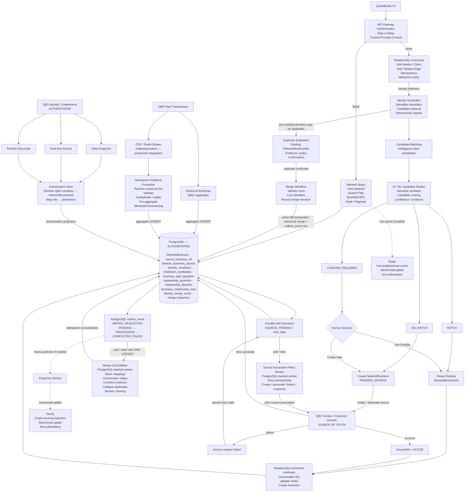
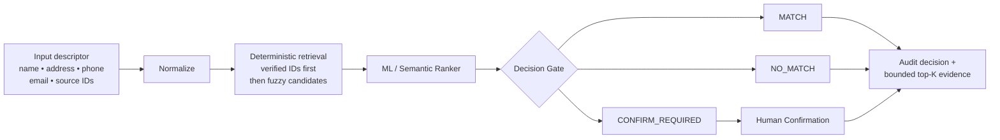
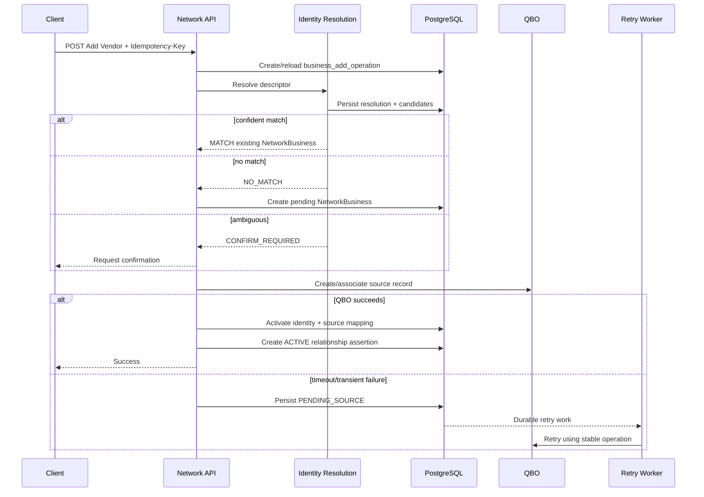
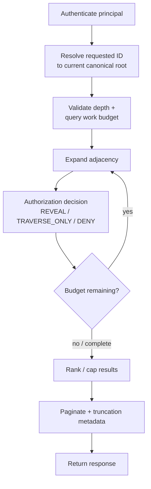
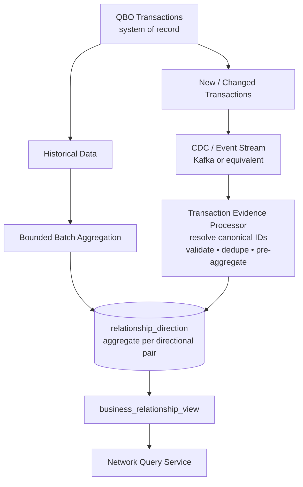
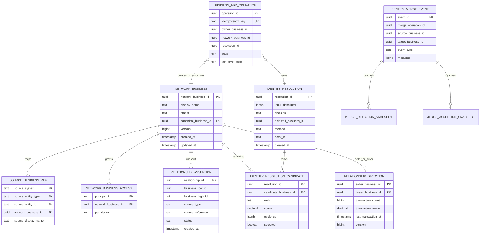
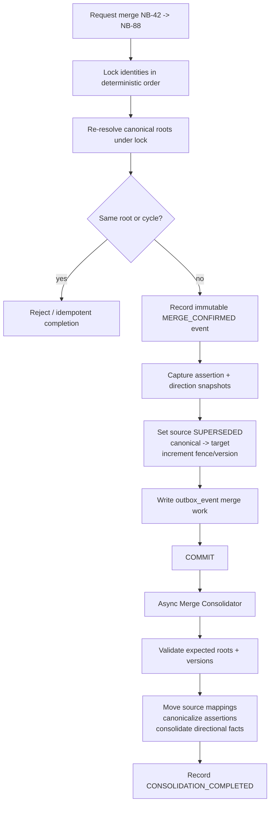
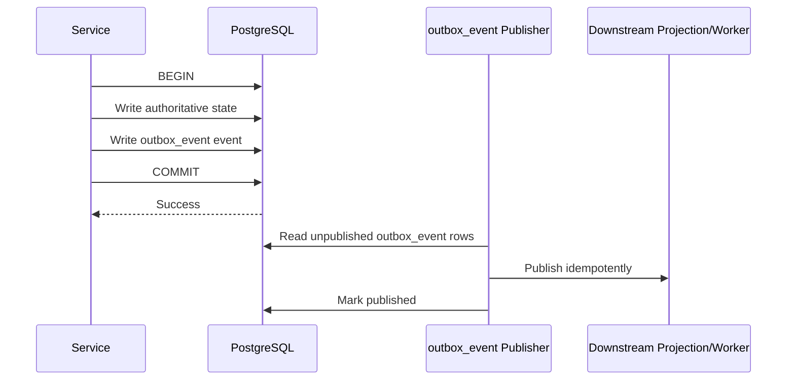
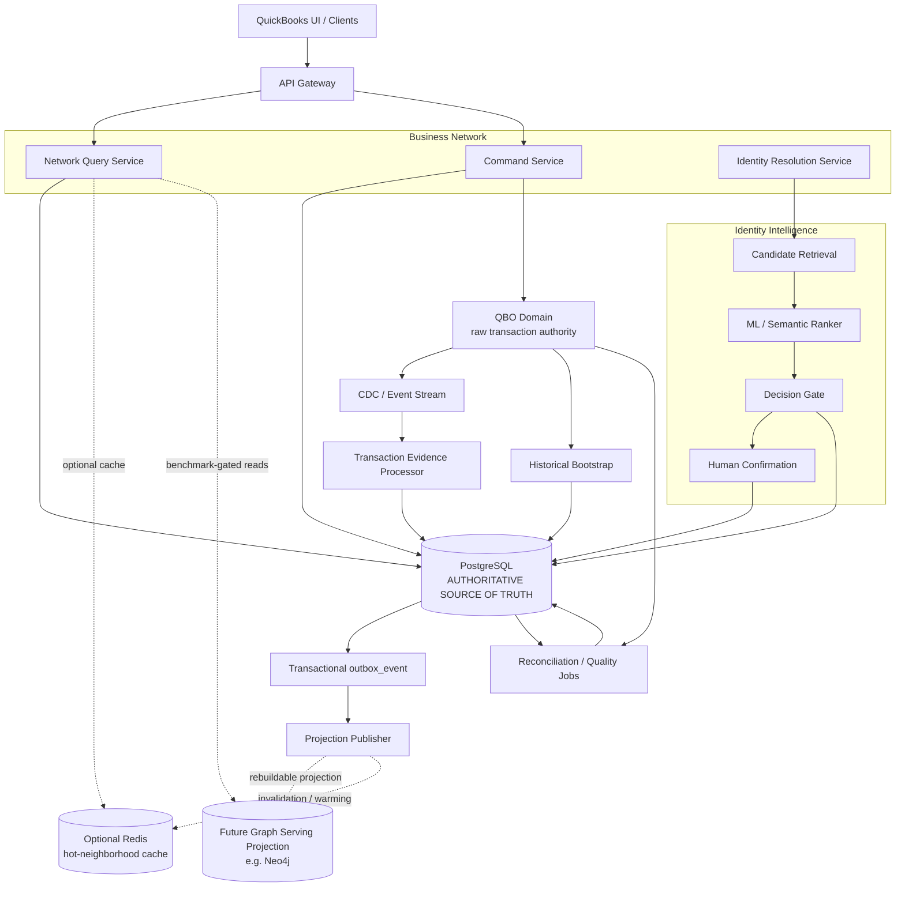

# QuickBooks Business Network — Technical Design Reference

> **Purpose:** Panel-facing engineering deep dive accompanying the Craft
> System Design presentation.  
> **Status:** Provisional V1 design. PostgreSQL-first authoritative
> architecture with explicit evolution seams.  
> **Scope:** Business identity, relationship topology, bounded
> traversal, reliability, AI-assisted entity resolution, and
> evidence-driven evolution.

------------------------------------------------------------------------

## Contents

1.  [Design Summary](#1-design-summary)
2.  [Problem, Requirements &
    Assumptions](#2-problem-requirements--assumptions)
3.  [Scale & Architectural Drivers](#3-scale--architectural-drivers)
4.  [V1 High-Level Architecture](#4-v1-high-level-architecture)
5.  [Canonical Business Identity](#5-canonical-business-identity)
6.  [AI-Assisted Identity
    Resolution](#6-ai-assisted-identity-resolution)
7.  [Core Write & Read Flows](#7-core-write--read-flows)
8.  [Data Model & ER Diagram](#8-data-model--er-diagram)
9.  [Physical PostgreSQL Schema](#9-physical-postgresql-schema)
10. [Relationship Semantics &
    Traversal](#10-relationship-semantics--traversal)
11. [Identity Merge & Concurrency](#11-identity-merge--concurrency)
12. [Reliability & Failure Handling](#12-reliability--failure-handling)
13. [Datastore Decision & Falsifiable Pivot
    Criteria](#13-datastore-decision--falsifiable-pivot-criteria)
14. [Evolution Architecture](#14-evolution-architecture)
15. [API Surface](#15-api-surface)
16. [Security, Privacy &
    Authorization](#16-security-privacy--authorization)
17. [Observability & Operations](#17-observability--operations)
18. [Key Trade-offs](#18-key-trade-offs)

------------------------------------------------------------------------

# 1. Design Summary

QuickBooks Business Network allows a business to:

- view its business network;
- determine whether another business is directly or indirectly related;
- inspect a bounded relationship path;
- add a vendor/client even when the same real business appears under
  different descriptors;
- preserve privacy while traversing relationships;
- remain responsive under highly skewed graph topology.

The key design decision is to **separate canonical business identity
from QuickBooks role-oriented source records**.

A QuickBooks Vendor and a QuickBooks Customer may represent the same
real-world business. The network therefore operates on a canonical
`NetworkBusinessId`, while retaining mappings back to source records.

### V1 principles

| Principle               | V1 decision                                                          |
|-------------------------|----------------------------------------------------------------------|
| System of record        | PostgreSQL                                                           |
| Graph depth             | Server-capped, initially `<= 3` hops                                 |
| Path semantics          | Shortest path by hop count                                           |
| Identity ambiguity      | Human confirmation; no ambiguous auto-merge                          |
| Authorization           | Evaluated during traversal                                           |
| Relationship topology   | Defined by active relationship assertions                            |
| Transaction information | Directional evidence, not topology by itself                         |
| Transaction ownership   | QBO remains authoritative for raw transaction-level financial data    |
| Evidence ingestion      | Historical bootstrap + incremental CDC/event processing                |
| Evidence storage        | Aggregate per directional business pair; no raw transaction copy       |
| Cache                   | Optional optimization; never authoritative                           |
| Graph database          | Future serving projection only if benchmarks justify it              |
| AI                      | Candidate ranking/assistance; no direct authoritative graph mutation |

The architecture deliberately keeps V1 operationally simple while
leaving explicit seams for Redis, graph-native serving, and improved
ML-based identity resolution.

------------------------------------------------------------------------

# 2. Problem, Requirements & Assumptions

## Functional requirements

1.  View a business's direct and bounded indirect network.
2.  Search whether business `A` is connected to business `B`.
3.  Return a relationship path when policy permits.
4.  Add a vendor/client and associate it with an existing real-world
    business when appropriate.
5.  Resolve multiple source records to one canonical business identity.
6.  Maintain relationship provenance and directional transaction
    evidence.
7.  Merge duplicate canonical identities safely and auditably.
8.  Support idempotent mutations and recovery from partial external
    failures.

## Non-functional requirements

- Responsive bounded network queries.
- High availability for core reads and writes.
- Correctness before serving-layer optimization.
- Privacy-safe traversal.
- Auditable identity decisions and merges.
- Idempotent mutation semantics.
- Recoverability from downstream/QBO failures.
- Measurable datastore evolution rather than technology selection by
  intuition.

## Important assumptions

| ID  | Assumption                                                                                                                      |
|-----|---------------------------------------------------------------------------------------------------------------------------------|
| A1  | QBO Vendor and Customer records are role-oriented source records.                                                               |
| A2  | Unless QBO already exposes a suitable canonical cross-role identifier, Business Network introduces `NetworkBusinessId`.         |
| A4  | Initial product traversal is bounded to 3 hops and server capped.                                                               |
| A5  | Relationship path means shortest path by number of hops, not by transaction weight.                                             |
| A6  | PostgreSQL-only V1 provides authoritative read-your-writes behavior; future projections may be eventually consistent.           |
| A7  | Authorization is enforced while traversing, not only at the final response.                                                     |
| A8  | Policy may return `REVEAL`, `TRAVERSE_ONLY`, or `DENY`.                                                                         |
| A9  | Ambiguous identity resolution requires confirmation; V1 never auto-merges an ambiguous candidate.                               |
| A10 | Identity resolution is synchronous in the initial flow.                                                                         |
| A11 | No arbitrary relationship-weight formula is invented. Raw count, amount, and recency evidence are preserved.                    |
| A12 | Exact relationship provenance types are Product-defined; examples such as `USER`, `TRANSACTION`, and `IMPORT` are illustrative. |
| A13 | Network-view compute budget is distinct from response-size budget.                                                              |
| A14 | Point-to-point path search has a separate work budget from network expansion.                                                   |
| A15 | QBO remains authoritative for raw transaction-level financial data.                                                            |
| A16 | Business Network consumes transaction changes through a CDC/event contract or equivalent incremental feed; exact QBO integration is to be validated. |
| A17 | Existing transaction history can be bootstrapped through a bounded batch aggregation rather than copied transaction-by-transaction. |
| A18 | The incremental feed exposes a stable transaction/event identity, source version, or equivalent offset contract sufficient for replay-safe processing. |
| A19 | Historical bootstrap and live processing meet at an explicit watermark/cutover position to prevent double counting.              |

If QBO already owns a stable canonical cross-role business identifier,
the identity layer becomes materially simpler: the network can adopt
that identifier without changing the graph/query boundaries.

------------------------------------------------------------------------

# 3. Scale & Architectural Drivers

Initial scale:

- approximately **1 million businesses**;
- up to **100 direct relationships per business**;
- approximately **10 million network searches/month**;
- highly skewed traffic and degree distribution;
- undirected network experience with directional transaction evidence.

Average search throughput is modest:

``` text
10,000,000 / 30 / 24 / 3600 ≈ 3.86 searches/sec
```

Even a 50× burst is only roughly:

``` text
≈ 193 searches/sec
```

Throughput alone therefore does **not** justify graph-specialized
infrastructure.

Transaction evidence introduces a **separate scaling dimension** from network
search QPS. The assignment does not provide QBO transaction throughput, so the
design does not invent one. Raw transactions remain in QBO and Business Network
stores compact directional aggregates. Evidence storage therefore scales with
directional business pairs rather than raw transaction count.

``` text
READ / TRAVERSAL SCALE                 EVIDENCE INGESTION SCALE
10M searches/month                     potentially very large QBO history
<=100 direct relationships             continuous transaction changes
bounded depth <=3                      replay / write-amplification concerns

Primary risk: traversal amplification  Primary risk: ingest + DB write amplification
```

The more important issue on the read path is **traversal amplification**.

At maximum degree 100, a naive expansion can approach:

``` text
Depth 1:       100 candidates
Depth 2:    10,000 candidates
Depth 3: 1,000,000 candidates
```

Real graphs contain overlap and cycles, but the architecture cannot
depend on that.

Therefore:

> **Maximum depth is not a work limit.**

Every query also has explicit limits such as:

``` text
maxDepth
maxNodesExplored
maxEdgesExplored
timeout
resultLimit
pagination
```

This prevents a high-degree business from turning a nominally
small-depth query into uncontrolled work.

------------------------------------------------------------------------

# 4. V1 High-Level Architecture


### ASCII architecture — interview / quick-view version

The Mermaid diagram below is useful when rendered by GitHub, but this ASCII version is intentionally kept alongside it for easier review and interview discussion.

```text
                                      QUICKBOOKS UI
                                           |
                                           v
                                  +-------------------+
                                  |    API Gateway    |
                                  | AuthN / Rate Limit|
                                  | Trusted Principal |
                                  +---------+---------+
                                            |
                         +------------------+------------------+
                         |                                     |
                       READ                                  WRITE
                         |                                     |
                         v                                     v
              +----------------------+              +----------------------+
              |    Network Query     |              | Relationship Command |
              |----------------------|              |----------------------|
              | View Network         |              | Add Vendor / Client  |
              | Search Path          |              | Add / Retract Edge   |
              | Bounded BFS          |              | Idempotency / AuthZ  |
              +----------+-----------+              +----------+-----------+
                         |                                     |
                         |                              identity unknown
                         |                                     |
                         |                                     v
                         |                         +------------------------+
                         |                         |  Identity Resolution   |
                         |                         |------------------------|
                         |                         | Normalize descriptor   |
                         |                         | Candidate retrieval    |
                         |                         | Deterministic signals  |
                         |                         +-----+-------------+----+
                         |                               |             |
                         |                    candidates |             | possible
                         |                               |             | duplicate
                         |                               v             v
                         |                    +----------------+  +------------------+
                         |                    | AI / ML        |  | Duplicate        |
                         |                    | Candidate      |  | Evaluation       |
                         |                    | Ranker         |  | existing NB IDs  |
                         |                    +-------+--------+  +--------+---------+
                         |                            |                    |
                         |             +--------------+--------------+     |
                         |             |              |              |     |
                         |             v              v              v     |
                         |           MATCH        NO_MATCH       CONFIRM   |
                         |             |              |          REQUIRED  |
                         |             |              |              |     |
                         |             |              |              v     |
                         |             |              |        Human Decision
                         |             |              |         /          \
                         |             |              |  Use Existing   Create New
                         |             |              |       |             |
                         |             v              v       v             v
                         |        +-------------+   +--------------------------+
                         |        | Reuse       |   | Create NetworkBusiness   |
                         |        | Existing NB |   | PENDING_SOURCE           |
                         |        +------+------+   +-------------+------------+
                         |               |                        |
                         |               |                        | create / associate
                         |               |                        v
                         |               |              +----------------------+
                         |               |              | QBO Vendor / Customer|
                         |               |              | SOURCE OF TRUTH      |
                         |               |              +----+-------------+---+
                         |               |                   |             |
                         |               |                success        failure
                         |               |                   |             |
                         |               +---------+---------+             |
                         |                         |                       |
                         |                         v                       v
                         |              +----------------------+   Durable Add Operation
                         |              | Relationship Command |   SOURCE_PENDING
                         |              | continues            |          |
                         |              | canonicalize / AuthZ |          v
                         |              | create assertion     |   Source Association
                         |              +----------+-----------+   Retry Worker
                         |                         |                       |
                         |                         |                       +----> QBO
                         |                         |
                         +-------------------------+-----------------------+
                                                   |
                                                   v
                    +----------------------------------------------------------------+
                    |                 POSTGRESQL — AUTHORITATIVE                     |
                    |----------------------------------------------------------------|
                    | NetworkBusiness              source_business_ref               |
                    | network_business_access      identity_resolution               |
                    | resolution_candidates        business_add_operation            |
                    | relationship_assertion       relationship_direction            |
                    | business_relationship_view   identity_merge_event              |
                    | merge snapshots              outbox_event                      |
                    +-------------+----------------------+---------------------------+
                                  |                      ^
                                  |                      |
                         MERGE_REQUESTED                 |
                                  |                      |
                                  v                      |
                         +----------------+              |
                         | outbox_event   |              |
                         | PENDING        |              |
                         +-------+--------+              |
                                 |                       |
                         atomic claim                    |
                   PENDING -> PROCESSING                 |
                                 |                       |
                                 v                       |
                      +----------------------+           |
                      | Merge Consolidator   |-----------+
                      |----------------------|
                      | Move mappings        |
                      | Canonicalize edges   |
                      | Combine evidence     |
                      | Collapse duplicates  |
                      | Version / fencing    |
                      +----------------------+

DUPLICATE / MERGE PATH
----------------------

Identity Resolution
       |
       +---- two existing NetworkBusinessIds may represent same real business
       |
       v
Duplicate Evaluation
       |
       | confirmed according to evidence / policy
       v
Merge Workflow
       |
       | SAME PostgreSQL transaction:
       |   1. mark source SUPERSEDED
       |   2. set canonical_business_id
       |   3. write identity_merge_event + snapshots
       |   4. insert MERGE_REQUESTED into outbox_event
       v
PostgreSQL
       |
       v
outbox_event: PENDING
       |
       | SELECT ... FOR UPDATE SKIP LOCKED
       | + UPDATE status = PROCESSING
       | + COMMIT claim transaction
       v
Merge Consolidator
       |
       +---- mappings
       +---- relationship assertions
       +---- directional evidence
       +---- duplicate logical edges
       |
       v
PostgreSQL
       |
       +---- outbox_event = COMPLETED
       +---- CONSOLIDATION_COMPLETED business-level guard


TRANSACTION EVIDENCE PATH
-------------------------

QBO Raw Transactions
        |
        +---------------------------+
        |                           |
        v                           v
Historical Bootstrap        CDC / Event Stream
batch aggregate             Kafka/equivalent
        |                           |
        |                           v
        |                 Transaction Evidence
        |                 Processor
        |                           |
        +-------------+-------------+
                      |
              aggregate UPSERT
                      |
                      v
            relationship_direction
                      |
                      v
                 PostgreSQL


AUTHORIZATION SYNC
------------------

QBO Identity / Entitlements
      SOURCE OF TRUTH
              |
     +--------+---------+
     |        |         |
     v        v         v
 Snapshot   Events   Reconcile
     |        |         |
     +--------+---------+
              |
              v
     Authorization Sync
              |
      QBO company -> NB ID
      role -> permission
              |
              v
 network_business_access
              |
              v
          PostgreSQL
```



### V1 asynchronous-work model

`MERGE_REQUESTED` does **not** imply Kafka. In V1, the authoritative merge decision and a `MERGE_REQUESTED` outbox_event row are committed atomically in the same PostgreSQL transaction. A PostgreSQL-backed Merge Consolidator polls/claims pending rows (for example with `FOR UPDATE SKIP LOCKED`), performs idempotent consolidation, and marks the work completed or failed. Kafka or another broker can be introduced later as an outbox_event publication target if throughput or integration fan-out justifies it.

`PENDING_SOURCE` is durable operation state rather than a Kafka event. If QBO Vendor/Customer creation fails or times out, `business_add_operation` / the business status retains the incomplete operation. A Source Association Retry Worker polls eligible operations, retries the QBO association idempotently, and updates the same PostgreSQL state on success.

The transaction-evidence path is separate: the production design may consume QBO transaction changes through CDC / an event stream (`Kafka/equivalent`), but that is an integration/evolution path and should not be presented as already implemented in the V1 reference code unless the corresponding producer/consumer exists.


### PostgreSQL outbox physical schema

The V1 asynchronous merge path uses a PostgreSQL-backed transactional outbox. The table is named `outbox_event`; Kafka is not required for merge correctness.

```sql
CREATE TABLE outbox_event (
    event_id        UUID PRIMARY KEY,
    event_type      VARCHAR(50) NOT NULL,
    aggregate_type  VARCHAR(50) NOT NULL,
    aggregate_id    UUID NOT NULL,
    payload         JSONB NOT NULL,

    status          VARCHAR(20) NOT NULL DEFAULT 'PENDING',
    attempt_count   INT NOT NULL DEFAULT 0,

    created_at      TIMESTAMPTZ NOT NULL DEFAULT CURRENT_TIMESTAMP,
    available_at    TIMESTAMPTZ NOT NULL DEFAULT CURRENT_TIMESTAMP,
    claimed_at      TIMESTAMPTZ NULL,
    processed_at    TIMESTAMPTZ NULL,
    last_error      TEXT NULL,

    CHECK (status IN ('PENDING', 'PROCESSING', 'COMPLETED', 'FAILED'))
);

CREATE INDEX idx_outbox_event_pending
ON outbox_event (event_type, available_at, created_at)
WHERE status = 'PENDING';
```

A merge writes the canonical identity change, merge audit/snapshots, and the outbox event in the **same PostgreSQL transaction**:

```sql
BEGIN;

-- lock and validate source/target identities
-- mark source NetworkBusiness as SUPERSEDED
-- set canonical_business_id to the target
-- insert identity_merge_event
-- insert merge snapshots

INSERT INTO outbox_event (
    event_id,
    event_type,
    aggregate_type,
    aggregate_id,
    payload,
    status
)
VALUES (
    :event_id,
    'MERGE_REQUESTED',
    'NETWORK_BUSINESS',
    :source_business_id,
    :payload::jsonb,
    'PENDING'
);

COMMIT;
```

Example logical row:

| Column | Example |
|---|---|
| `event_id` | `E100` |
| `event_type` | `MERGE_REQUESTED` |
| `aggregate_type` | `NETWORK_BUSINESS` |
| `aggregate_id` | `NB450` |
| `payload` | `{"sourceBusinessId":"NB450","targetBusinessId":"NB200","mergeEventId":"M100"}` |
| `status` | `PENDING` |
| `attempt_count` | `0` |

The Merge Consolidator claims pending work from PostgreSQL. Multiple worker instances can safely divide queue work using row locking:

```sql
BEGIN;

-- 1. Lock a bounded set of eligible rows so concurrent workers skip them.
SELECT event_id
FROM outbox_event
WHERE event_type = 'MERGE_REQUESTED'
  AND status = 'PENDING'
  AND available_at <= CURRENT_TIMESTAMP
ORDER BY created_at
FOR UPDATE SKIP LOCKED
LIMIT :batch_size;

-- 2. In the SAME transaction, durably record ownership before releasing locks.
UPDATE outbox_event
SET status = 'PROCESSING',
    claimed_at = CURRENT_TIMESTAMP,
    attempt_count = attempt_count + 1
WHERE event_id = ANY(:claimed_ids);

COMMIT;
```

Only after this claim transaction commits does the worker perform the potentially longer merge consolidation. This makes `PROCESSING` a real durable state rather than merely a row lock. A later poll cannot claim the same row while it remains `PROCESSING`.

In an implementation, the select-and-update can also be expressed as a single PostgreSQL statement using a CTE with `UPDATE ... RETURNING`; the required invariant is the same: **selection and the transition to `PROCESSING` are atomic before consolidation starts**.

Processing remains idempotent even though claiming prevents normal duplicate delivery. After successful consolidation the worker marks the event `COMPLETED` and sets `processed_at`.

For a retryable failure, the worker must not immediately expose the same row to a tight retry loop. It transitions the row back to `PENDING`, records `last_error`, clears the claim, and moves `available_at` forward using a bounded backoff policy derived from `attempt_count`:

```sql
UPDATE outbox_event
SET status = 'PENDING',
    claimed_at = NULL,
    last_error = :last_error,
    available_at = CURRENT_TIMESTAMP + :backoff_interval
WHERE event_id = :event_id
  AND status = 'PROCESSING';
```

Conceptually, `backoff_interval = backoff(attempt_count)`; the exact base delay, multiplier, jitter, and cap are operational configuration rather than hard-coded architecture assumptions.

Retry exhaustion is also explicit configuration. Define a `max_attempts` policy parameter (value TBD from operational requirements). When a failure is classified as permanent, or `attempt_count >= max_attempts`, transition the event to `FAILED` instead of returning it to `PENDING`, and surface it through metrics/alerts and an operator-visible recovery path.

There are deliberately **two layers of idempotency**. The `outbox_event` lifecycle (`PENDING → PROCESSING → COMPLETED`) is the transport/work-queue guard that prevents the same outbox row from being processed repeatedly. The Merge Consolidator's existing `identity_merge_event` / `CONSOLIDATION_COMPLETED` check is a second, business-level guard: if the same `merge_operation_id` is accidentally re-queued in a different outbox row with a new `event_id`, the merge decision is still not consolidated twice.

The ownership distinction is intentional:

```text
MERGE_REQUESTED
      |
      v
outbox_event
      |
      v
Merge Consolidator

PENDING_SOURCE
      |
      v
network_business.status
+ business_add_operation.state
      |
      v
Source Association Retry Worker
```

`MERGE_REQUESTED` represents durable asynchronous work caused by an already committed merge decision. `PENDING_SOURCE` represents an incomplete Add Vendor/Customer operation that must be resumed; it is not a merge outbox event.

### Authority boundary

PostgreSQL owns authoritative Business Network state.

Redis, if introduced, is disposable acceleration. A future graph store
is also a **rebuildable serving projection**, not a second source of
truth.

This avoids synchronous dual writes and keeps correctness decisions
inside transactional boundaries.

------------------------------------------------------------------------

# 5. Canonical Business Identity

A source record is not automatically a network identity.

Example:

``` text
QBO Vendor V-17
"ABC Ltd"
       \
        \
         -> Entity Resolution -> NetworkBusiness NB-42
        /
       /
QBO Customer C-91
"ABC Ltd"
```

Both source records can map to the same real-world business.

## Ownership boundary

**QBO owns**

- vendor/customer source records;
- source attributes;
- financial transactions.

**Business Network owns**

- canonical network identity;
- source-to-canonical mappings;
- resolution decisions;
- merge/audit state;
- relationship topology and serving semantics.

A source record is addressed by:

``` text
SourceRecordKey =
    sourceSystem
  + sourceEntityType
  + sourceEntityId
```

The network uses `NetworkBusinessId` for relationship endpoints so
topology is not fragmented merely because the same business participates
in multiple QBO roles.

------------------------------------------------------------------------

# 6. AI-Assisted Identity Resolution

AI/ML improves candidate ranking; it does not own identity truth.



## Resolution strategy

### 1. Normalize

Normalize fields such as:

- business name;
- address;
- phone;
- email/domain;
- known source identifiers.

### 2. Retrieve candidates

Prefer strong deterministic identifiers first. If those do not resolve
the identity, retrieve a bounded candidate set using normalized/fuzzy
attributes.

### 3. Rank

A deterministic, ML, or semantic ranker scores the candidate set.

The ranker is replaceable and versioned. The architecture does not
depend on a specific model or vendor.

### 4. Decide

``` text
MATCH
NO_MATCH
CONFIRM_REQUIRED
```

Ambiguous results go to human confirmation.

### 5. Audit

Persist:

- input descriptor;
- selected candidate;
- bounded top-K candidates;
- evidence;
- score/rank;
- resolver/model version;
- actor;
- timestamp.

## AI quality metrics

- Recall@K
- suggested-match precision
- confirmation rate
- false-merge rate
- reversal rate
- quality segmented by input-data quality

If the ranking capability is unavailable, the system fails closed for
ambiguous cases. Deterministic resolution may continue where evidence is
sufficient.

------------------------------------------------------------------------

# 7. Core Write & Read Flows

## 7.1 Add Vendor



### Important invariant

> A relationship is not created against an identity that has not reached
> the required active/source-associated state.

The durable `business_add_operation` lets retries resume rather than
recreate identity, source records, or relationships.

------------------------------------------------------------------------

## 7.2 Network Read



Authorization is part of traversal semantics.

A hidden business cannot simply be discovered internally and filtered at
the end, because doing so can leak its existence through paths or
counts.

------------------------------------------------------------------------

------------------------------------------------------------------------

## 7.3 Transaction Evidence Ingestion

QBO remains the system of record for raw financial transactions. Business
Network does **not** scan QBO transaction history during a graph read and does
not copy every transaction into its PostgreSQL serving model.



Example:

``` text
T1  NB200 -> NB100  ₹10K
T2  NB200 -> NB100  ₹20K
T3  NB200 -> NB100  ₹30K
            |
            v
short-window / batch aggregation
            |
            v
NB200 -> NB100 | count=3 | amount=₹60K
```

### Scale and correctness properties

- **Horizontal processing:** partition the stream by a stable business/account
  key so evidence processors can scale horizontally.
- **Pre-aggregation:** combine changes for the same directional pair before
  batched PostgreSQL UPSERTs when needed.
- **Replay safety:** redelivery must not increment count or amount twice; the
  source needs a stable event/transaction identity, source version, or
  equivalent offset contract.
- **Historical bootstrap:** aggregate existing QBO history through a bounded
  batch path.
- **Bootstrap/live cutover:** use an explicit watermark/cutover position to
  prevent double counting.
- **Failure isolation:** quarantine/reconcile malformed or unresolved evidence
  rather than corrupting the aggregate.

The exact QBO event contract, throughput, retention, partition count, and
change semantics are integration/capacity-planning details to validate with
the QBO transaction domain.


# 8. Data Model & ER Diagram

The model separates these core concerns:

1.  canonical business identity;
2.  source-system mappings;
3.  access control;
4.  relationship existence/provenance;
5.  directional transaction evidence;
6.  identity-resolution audit;
7.  durable mutation/orchestration state;
8.  merge/consolidation history.

Raw QBO transactions are intentionally outside this model. Business Network
stores only the derived evidence required for network serving.



### Derived serving relationship

`business_relationship_view` is derived from:

``` text
ACTIVE relationship assertions
            +
directional evidence aggregated for the same pair
            ↓
undirected relationship serving view
```

It has no independent lifecycle and is never independently mutated.

------------------------------------------------------------------------

# 9. Physical PostgreSQL Schema

The following is the V1 physical model at design level. Exact PostgreSQL
DDL belongs with the implementation.

## `network_business`

| Column                  | Type        | Constraint / index | Why it exists                                                                  |
|-------------------------|-------------|--------------------|--------------------------------------------------------------------------------|
| `network_business_id`   | UUID/BIGINT | PK                 | Stable canonical network identifier                                            |
| `display_name`          | TEXT        |                    | Human-readable identity                                                        |
| `status`                | ENUM/TEXT   | indexed            | `ACTIVE`, `PENDING_SOURCE`, `SOURCE_CREATION_FAILED`, `SUPERSEDED`             |
| `canonical_business_id` | UUID/BIGINT | nullable self-FK   | Redirects a merged identity to its canonical root; prevents stale identity use |
| `version`               | BIGINT      |                    | Fencing/version validation for merge/write races                               |
| `created_at`            | TIMESTAMP   |                    | Audit/operations                                                               |
| `updated_at`            | TIMESTAMP   |                    | Reconciliation/operations                                                      |

Invariant:

``` text
canonical_business_id != network_business_id
```

Canonical-root resolution plus locked merge validation prevents redirect
cycles.

------------------------------------------------------------------------

## `source_business_ref`

| Column                | Type        | Constraint / index | Why it exists                                    |
|-----------------------|-------------|--------------------|--------------------------------------------------|
| `source_system`       | TEXT        | composite PK       | Identifies source namespace                      |
| `source_entity_type`  | TEXT        | composite PK       | Distinguishes Vendor/Customer/etc.               |
| `source_entity_id`    | TEXT        | composite PK       | Stable source identifier                         |
| `network_business_id` | UUID/BIGINT | FK + index         | Maps source record to canonical network identity |
| `source_display_name` | TEXT        |                    | Resolution/audit context                         |
| timestamps            | TIMESTAMP   |                    | Reconciliation/audit                             |

This table is the boundary between QBO source identity and network
identity.

------------------------------------------------------------------------

## `network_business_access`

| Column                | Type        | Constraint / index | Why it exists                          |
|-----------------------|-------------|--------------------|----------------------------------------|
| `principal_id`        | TEXT        | composite PK       | Calling user/tenant/principal          |
| `network_business_id` | UUID/BIGINT | composite PK       | Protected network identity             |
| `permission`          | TEXT        |                    | Input to centralized policy evaluation |

Policy evaluation converts access data and context into:

``` text
REVEAL
TRAVERSE_ONLY
DENY
```

------------------------------------------------------------------------

## `business_add_operation`

| Column                | Type        | Constraint / index | Why it exists                           |
|-----------------------|-------------|--------------------|-----------------------------------------|
| `operation_id`        | UUID        | PK                 | Stable workflow identity                |
| `idempotency_key`     | TEXT        | UNIQUE             | Prevents duplicate Add Vendor mutations |
| `owner_business_id`   | UUID/BIGINT | FK                 | Business initiating the operation       |
| `network_business_id` | UUID/BIGINT | nullable FK        | Resolved/created identity               |
| `resolution_id`       | UUID        | nullable FK        | Resolution evidence                     |
| `state`               | TEXT        | indexed            | Durable workflow progress               |
| `last_error_code`     | TEXT        |                    | Retry/reconciliation diagnostics        |
| timestamps            | TIMESTAMP   |                    | Detects stuck operations                |

Representative states:

``` text
RESOLVING
AWAITING_CONFIRMATION
SOURCE_PENDING
SOURCE_CREATED
RELATIONSHIP_CREATED
FAILED
```

------------------------------------------------------------------------

## `identity_resolution`

| Column                 | Type        | Constraint / index | Why it exists                              |
|------------------------|-------------|--------------------|--------------------------------------------|
| `resolution_id`        | UUID        | PK                 | Resolution attempt                         |
| `input_descriptor`     | JSONB       |                    | Exact input used for decision              |
| `decision`             | TEXT        |                    | `MATCH`, `NO_MATCH`, `CONFIRM_REQUIRED`    |
| `selected_business_id` | UUID/BIGINT | nullable FK        | Final selected canonical candidate         |
| `method`               | TEXT        |                    | Rule/resolver/model version                |
| `actor_id`             | TEXT        |                    | User/system responsible for final decision |
| `created_at`           | TIMESTAMP   |                    | Audit                                      |

### `identity_resolution_candidate`

| Column                  | Type        | Constraint / index | Why it exists                 |
|-------------------------|-------------|--------------------|-------------------------------|
| `resolution_id`         | UUID        | composite PK       | Parent decision               |
| `candidate_business_id` | UUID/BIGINT | composite PK       | Candidate identity            |
| `rank`                  | INT         |                    | Candidate ordering            |
| `score`                 | DECIMAL     |                    | Ranker output                 |
| `evidence`              | JSONB       |                    | Explainability/audit evidence |
| `selected`              | BOOLEAN     |                    | Records chosen candidate      |

Only a bounded top-K candidate set is retained.

------------------------------------------------------------------------

## `relationship_assertion`

| Column             | Type        | Constraint / index | Why it exists                   |
|--------------------|-------------|--------------------|---------------------------------|
| `relationship_id`  | UUID        | PK                 | Stable provenance record        |
| `business_low_id`  | UUID/BIGINT | index              | Canonically ordered endpoint    |
| `business_high_id` | UUID/BIGINT | index              | Canonically ordered endpoint    |
| `source_type`      | TEXT        |                    | Relationship provenance         |
| `source_reference` | TEXT        |                    | Idempotency/audit of provenance |
| `status`           | TEXT        | index              | `ACTIVE` / `RETRACTED`          |
| `created_by`       | TEXT        |                    | Audit                           |
| `created_at`       | TIMESTAMP   |                    | Audit                           |
| `retracted_by`     | TEXT        | nullable           | Audit                           |
| `retracted_at`     | TIMESTAMP   | nullable           | Audit                           |

Constraints:

``` text
business_low_id < business_high_id

UNIQUE (
    business_low_id,
    business_high_id,
    source_type,
    source_reference
)
```

Multiple independent assertions may support the same edge. Retraction of
one provenance source therefore does not necessarily remove the edge.

------------------------------------------------------------------------

## `relationship_direction`

| Column                | Type        | Constraint / index | Why it exists            |
|-----------------------|-------------|--------------------|--------------------------|
| `seller_business_id`  | UUID/BIGINT | composite PK       | Directional endpoint     |
| `buyer_business_id`   | UUID/BIGINT | composite PK       | Directional endpoint     |
| `transaction_count`   | BIGINT      |                    | Raw directional evidence |
| `transaction_amount`  | DECIMAL     |                    | Raw directional evidence |
| `last_transaction_at` | TIMESTAMP   |                    | Recency evidence         |
| `version`             | BIGINT      |                    | Merge/write fencing      |

Index the reverse endpoint order as required for aggregation.

One row represents the aggregate for one **directional canonical business
pair**, not one QBO transaction. For example, 100,000 raw QBO transactions
between `NB200 -> NB100` can become one `relationship_direction` row containing
the aggregate count, amount, and latest transaction time.

This is the key scale boundary: graph-serving storage grows with directional
business relationships rather than raw transaction volume. Replay/deduplication
state belongs to the evidence-ingestion contract or dedicated processing state;
redelivery must not double-increment `transaction_count` or
`transaction_amount`.

### Why topology and transaction evidence are separate

Historical transaction totals must not accidentally keep a relationship
visible after every relationship assertion has been retracted.

Therefore:

``` text
edge exists        := at least one ACTIVE assertion
edge evidence      := directional aggregates
serving relationship := active edge + available evidence
```

------------------------------------------------------------------------

# 10. Relationship Semantics & Traversal

The product exposes an **undirected business network**, while financial
reality may be directional.

Example:

``` text
A sells to B
B buys from A
```

The network can expose:

``` text
A -------- B
```

while preserving directional evidence independently:

``` text
A -> B : count, amount, lastTransactionAt
B -> A : count, amount, lastTransactionAt
```

No arbitrary formula such as:

``` text
weight = amount × count × recency
```

is introduced until Product defines its meaning.

## Bounded expansion

A network-view query uses a bounded BFS-style expansion:

``` text
frontier = [start]
visited  = {start}

for depth in 1..maxDepth:
    next = []

    for node in frontier:
        for neighbor in authorizedAdjacency(node):
            consumeWorkBudget()

            if policy(neighbor) == DENY:
                continue

            if neighbor not visited:
                visited.add(neighbor)

                if policy(neighbor) == REVEAL:
                    addToResults(neighbor)

                if policy(neighbor) allows traversal:
                    next.add(neighbor)

            if budgetExceeded():
                return truncatedResult()

    frontier = next
```

The implementation uses database queries/batches rather than issuing one
SQL query per node.

## Path search

For unweighted shortest-hop semantics, bounded BFS is appropriate.

A result of:

``` text
NOT_FOUND_WITHIN_DEPTH
```

means only that no permitted path was found within the requested and
server-allowed envelope.

It does **not** prove global disconnection.

------------------------------------------------------------------------

# 11. Identity Merge & Concurrency

Identity merge is one of the highest-risk mutation paths because it
changes canonical endpoints used by concurrent relationship and
transaction writes.

Example:

``` text
NB-42  ----merge---->  NB-88

NB-42.status = SUPERSEDED
NB-42.canonical_business_id = NB-88
```

## Merge confirmation



## Concurrency strategy

Two complementary techniques are used.

### Pessimistic locking at merge confirmation

The identities involved in the canonical decision are locked in
deterministic order.

This protects the short, correctness-critical decision boundary.

### Optimistic fencing for ordinary/async writes

Ordinary writers:

1.  resolve the current canonical root;
2.  use/validate identity version where required;
3.  canonicalize endpoints before committing.

The asynchronous consolidator validates expected versions/root state
before applying work.

This avoids holding long locks during potentially large consolidation.

## Reversal

Merge snapshots preserve enough pre-merge state to support controlled
reversal when it remains unambiguous.

Unsafe reversal is rejected rather than guessed.

------------------------------------------------------------------------

# 12. Reliability & Failure Handling

## Failure-mode-driven design

| Failure mode                                           | Protection                                                               |
|--------------------------------------------------------|--------------------------------------------------------------------------|
| Client retries a mutation                              | `idempotency_key`, stable operation IDs, provenance uniqueness           |
| QBO fails midway through Add Vendor                    | Durable `business_add_operation`; `PENDING_SOURCE`; retry/reconciliation |
| Two merges overlap                                     | Deterministic row locks + canonical-root re-resolution                   |
| Merge would create redirect cycle                      | Same-root/cycle validation under lock                                    |
| Ordinary write races with merge                        | Resolve canonical root before write + version/fence validation           |
| Async merge worker operates on stale state             | Expected root/version validation; retry stale work                       |
| Merge event delivered twice                            | Stable `merge_operation_id` + append-only events + completion check      |
| Merge must be reversed                                 | Immutable audit + direction/assertion snapshots                          |
| Historical totals remain after relationship retraction | Serving edge gated by ACTIVE assertions                                  |
| Redis unavailable                                      | Bypass cache and read authoritative store                                |
| Future graph projection unavailable                    | Fall back to PostgreSQL authoritative path                               |
| Identity ranker unavailable                            | Fail closed for ambiguity; deterministic evidence may continue           |
| Transaction event delivered more than once              | Stable event identity/version/offset + idempotent/deduplicated aggregation |
| Evidence processor crashes after processing             | Replay from committed stream position without double counting            |
| PostgreSQL temporarily unavailable for evidence writes  | Durable stream retention + retry/backpressure                            |
| Evidence consumers fall behind                          | Consumer-lag monitoring + horizontal scaling                             |
| Historical bootstrap overlaps live stream               | Explicit watermark/cutover position                                      |
| Transaction change arrives out of order                 | Source version/event-time semantics where required                       |
| Transaction cannot resolve to canonical business IDs    | Quarantine/DLQ + reconciliation; do not corrupt aggregate                |

## Transactional outbox_event

Authoritative state change and event publication intent are committed
together.



This removes the classic failure window:

``` text
DB commit succeeds
        +
event publish fails
```

without requiring distributed transactions.

------------------------------------------------------------------------

# 13. Datastore Decision & Falsifiable Pivot Criteria

## Why PostgreSQL first?

The primary V1 difficulty is not raw QPS. It is:

- identity correctness;
- transactional source mapping;
- relationship provenance;
- authorization;
- idempotency;
- merge races;
- auditability;
- bounded traversal.

These fit naturally into a relational authoritative model.

| Criterion                     | PostgreSQL V1         | Graph serving store             |
|-------------------------------|-----------------------|---------------------------------|
| Identity/mapping transactions | Strong fit            | Not primary reason to adopt     |
| Constraints/idempotency       | Strong fit            | Additional coordination needed  |
| Audit/merge workflow          | Strong fit            | PG still useful                 |
| Direct adjacency              | Straightforward       | Strong fit                      |
| Bounded 2–3 hop traversal     | Must benchmark        | Natural graph semantics         |
| Deep/variable traversal       | Increasing complexity | Stronger fit                    |
| Operational footprint         | Lower                 | Higher                          |
| Additional consistency model  | None                  | Projection lag/rebuild required |

The decision is intentionally **falsifiable**.

## Benchmark matrix

Test at least:

``` text
Topology
- normal business
- hub business
- adversarial near-max branching
- hot-node concurrency

Query
- 1-hop network
- 2-hop network
- 3-hop network
- shortest path
- authorization-heavy traversal
```

Measure:

``` text
P50 / P95 / P99 latency
nodes explored
edges explored
authorization evaluations
rows scanned
DB CPU / IO
connection-pool pressure
query-plan stability
timeout/truncation rate
implementation complexity
```

Representative provisional latency objectives:

| Query                       | Initial target |
|-----------------------------|---------------:|
| Direct neighborhood         |    `<= 100 ms` |
| 2-hop bounded expansion     |    `<= 250 ms` |
| 3-hop bounded expansion     |    `<= 500 ms` |
| Bounded shortest-hop search |    `<= 750 ms` |

These are benchmark targets, not claims about measured production
performance.

## Pivot rule

``` text
Benchmark representative + adversarial workloads
                 |
                 v
        PostgreSQL meets envelope?
             /          \
           yes           no
            |             |
      Stay simple     Optimize query/index/
                      batching/work budgets
                            |
                            v
                     Still misses envelope?
                         /        \
                       no          yes
                        |           |
                    Stay PG     Introduce graph
                                serving projection
```

Redis is evaluated independently. A hot-neighborhood cache may be
justified even when PostgreSQL remains the graph-serving datastore.

------------------------------------------------------------------------

# 14. Evolution Architecture

The evolution path preserves one authoritative source while adding
specialized serving components only when measurements justify them.



## Evolution sequence

### Stage 1 — PostgreSQL-first V1

Use one authoritative store and prove correctness, privacy, and bounded
traversal.

### Stage 2 — Cache measured hot paths

If profiling shows repeated hot-neighborhood reads, introduce Redis
with:

- short TTL;
- version-aware/invalidation strategy;
- authoritative fallback;
- no correctness dependence.

### Stage 3 — Graph serving projection

Introduce graph-native serving only if representative/adversarial
benchmarks show that relational traversal cannot meet the required
envelope safely or maintainably.

The graph store receives changes asynchronously from the authoritative
outbox_event.

Consequences are explicit:

- projection lag must be measured;
- stale-read semantics must be defined;
- rebuild tooling is required;
- PostgreSQL remains authoritative;
- no synchronous PostgreSQL + graph dual-write.

### Stage 4 — Improve identity automation

Increase automation only after measured resolution quality supports it.

AI remains behind a decision gate and does not independently write
authoritative financial-network truth.

------------------------------------------------------------------------

# 15. API Surface

Representative API surface:

``` http
GET /businesses/{id}/network?depth=N
```

Returns a bounded authorized network view with pagination/truncation
metadata.

``` http
GET /relationships/path?from=A&to=B&maxDepth=N
```

Returns an authorized shortest-hop path within the bounded search
envelope.

``` http
POST /businesses/resolve
```

Resolves a descriptor to `MATCH`, `NO_MATCH`, or `CONFIRM_REQUIRED`.

``` http
POST /businesses/{owner}/vendors
Idempotency-Key: <key>
```

Starts/resumes Add Vendor.

``` http
POST /businesses/{owner}/vendors/confirm
```

Confirms an ambiguous identity candidate.

``` http
POST /relationships
Idempotency-Key: <key>
```

Creates relationship provenance rather than directly mutating a derived
serving edge.

``` http
POST /business-identity/merges
```

Starts a controlled canonical-identity merge.

``` http
POST /business-identity/merges/{id}/reverse
```

Requests reversal when stored snapshots and current state make reversal
safe.

## Response semantics

Useful response metadata includes:

``` json
{
  "maxDepth": 3,
  "truncated": true,
  "nextPageToken": "...",
  "workLimitReached": true
}
```

A bounded path miss should be distinguishable from a globally proven
absence of relationship.

------------------------------------------------------------------------

# 16. Security, Privacy & Authorization

Authorization is not merely an API-edge concern.

Consider:

``` text
A ---- B ---- C
```

If the caller can see `A` and `C` but cannot know that `B` exists,
returning the literal path leaks protected information.

The traversal policy therefore supports outcomes such as:

| Decision        | Meaning                                                                      |
|-----------------|------------------------------------------------------------------------------|
| `REVEAL`        | Node may be traversed and returned                                           |
| `TRAVERSE_ONLY` | Policy permits traversal but response must not reveal the protected identity |
| `DENY`          | Do not traverse or reveal                                                    |

The exact Product/privacy semantics of `TRAVERSE_ONLY` must be defined
carefully so path shape, counts, pagination, timing, and error responses
do not indirectly reveal hidden businesses.

Additional controls:

- authenticate at the gateway;
- authorize every requested root;
- evaluate access during expansion;
- canonicalize IDs before policy/data access;
- audit sensitive identity mutations;
- encrypt data in transit and at rest;
- apply least-privilege DB/service credentials;
- rate-limit expensive traversal separately from simple reads.

------------------------------------------------------------------------

# 17. Observability & Operations

## Query metrics

Track by depth/topology class:

``` text
latency P50/P95/P99
nodes explored
edges explored
results returned
truncation rate
timeout rate
authorization evaluation count/cost
DB rows scanned
DB CPU/IO
cache hit rate
```

## Write/recovery metrics

``` text
idempotent replay rate
outbox_event backlog / oldest age
PENDING_SOURCE count and age
source-association retry count
merge backlog
merge consolidation lag
stale-fence retry rate
reconciliation mismatches
```

## Transaction evidence metrics

``` text
event ingest rate
consumer lag / oldest event age
events processed/sec
duplicate/replay count
failed or quarantined events
pre-aggregation reduction ratio
PostgreSQL aggregate UPSERT rate
evidence processing latency
bootstrap progress
bootstrap/live watermark
canonical-resolution failures
```

## Identity metrics

``` text
MATCH / NO_MATCH / CONFIRM_REQUIRED distribution
candidate Recall@K
suggested-match precision
confirmation rate
false-merge rate
merge reversal rate
quality by descriptor completeness
model/resolver version
```

## Degradation order

When dependencies or capacity are constrained:

1.  protect correctness and privacy;
2.  protect authoritative writes;
3.  reduce traversal work/result budgets if necessary;
4.  bypass optional cache;
5.  fall back from optional graph projection;
6.  disable/limit nonessential enrichment;
7.  never trade ambiguous identity correctness for availability.

------------------------------------------------------------------------

# 18. Key Trade-offs

| Decision                             | Benefit                                           | Cost / limitation                                   |
|--------------------------------------|---------------------------------------------------|-----------------------------------------------------|
| PostgreSQL-first                     | Transactions, constraints, simpler operations     | Multi-hop traversal must be benchmarked             |
| Canonical `NetworkBusinessId`        | Stable cross-role topology                        | Requires identity-resolution layer                  |
| Human confirmation for ambiguity     | Reduces false merges                              | Adds user friction                                  |
| Bounded traversal                    | Predictable resource usage                        | Does not expose an unlimited graph                  |
| Separate compute/result budgets      | Protects system independently of UX response size | More query-policy machinery                         |
| Active assertions define topology    | Clear provenance and lifecycle                    | More modeling than deriving edges from transactions |
| Directional evidence kept separately | Preserves business reality                        | Serving projection requires aggregation             |
| Aggregate evidence instead of copying raw transactions | Serving/storage scale follows business relationships, not transaction count | Requires reliable incremental feed, replay-safe aggregation, bootstrap and reconciliation |
| No invented weight formula           | Avoids encoding unsupported Product semantics     | Weighted ranking deferred                           |
| Transactional outbox_event                 | Reliable asynchronous evolution                   | Requires publisher/idempotent consumers             |
| Async graph projection               | Avoids synchronous dual-write                     | Introduces eventual consistency                     |
| AI as ranking assistant              | Improves resolution while retaining control       | Requires evaluation/audit/confirmation              |
| Merge snapshots + fencing            | Safe recovery/concurrency                         | Additional storage and workflow complexity          |

------------------------------------------------------------------------

## Design Invariants

The design can be summarized by the invariants that must remain true as
the implementation evolves:

1.  **Every relationship endpoint resolves to a current canonical
    business identity.**
2.  **Ambiguous identity is never silently converted into an
    authoritative merge.**
3.  **Relationship existence is controlled by active provenance
    assertions, not historical transaction totals.**
4.  **Authorization participates in traversal; hidden identities are not
    merely filtered after computation.**
5.  **Depth limits and work limits are separate controls.**
6.  **Retries do not duplicate externally visible mutations.**
7.  **Merge races are protected by locked canonical decisions and
    version/fence validation.**
8.  **PostgreSQL is authoritative in V1; caches and future graph stores
    are rebuildable projections.**
9.  **AI ranks and assists; it does not bypass authoritative decision
    gates.**
10. **A new datastore is introduced because measured workloads require
    it, not because the domain happens to contain a graph.**
11. **QBO remains authoritative for transaction-level financial data;
    Business Network stores only the derived directional evidence required
    for network serving.**
12. **Transaction evidence processing is replay-safe: retries, redelivery,
    and bootstrap/live overlap must not double-count directional aggregates.**
